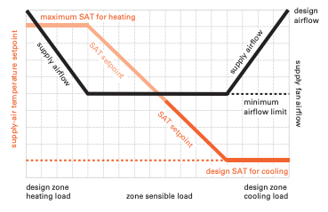
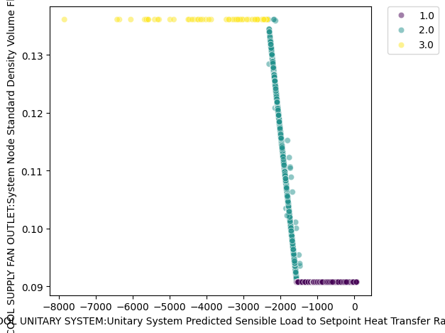
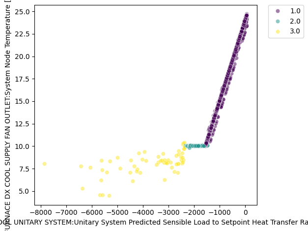
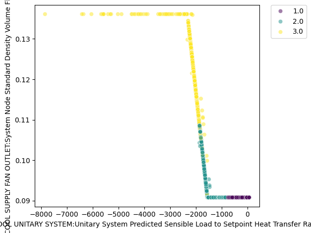
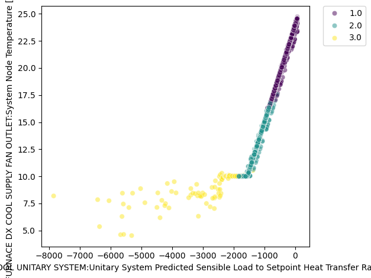

Single Zone VAV for Variable Speed Coils
================

**Jeremy Lerond, Pacific Northwest National Laboratory**

 - Original Date: 08/04/2025
 - Revision Date: 08/04/2025
 

## Justification for New Feature ##

The `SingleZoneVAV` control type for `AirLoopHVAC:UnitarySystem` currently only supports `Coil:Cooling/Heating:Water` or `Coil:Cooling/Heating:DX:SingleSpeed` coil objects. However, manufacturers make equipment that includes variable speed compressors which modulate to meet the required setpoint instead of cycling.

## E-mail and  Conference Call Conclusions ##

N/A

## Overview ##

The `Coil:Cooling/Heating:DX:VariableSpeed` objects cannot currently be used along with the `AirLoopHVAC:UnitarySystem`'s `SingleZoneVAV` control type. The goal of this feature is for these coils to be supported.

## Approach ##

The `SingleZoneVAV` control, adjusts the unit's SAT and/or airflow as shown below. The sequence of operation can be split into three zones: 1) the unit operate at its minimum flow rate and the SAT is adjusted to meet the load until it reaches its maximum/minimum value, 2) the SAT in held constant and the airflow rate is adjusted to meet the load and until the airflow rate reaches its maximum value, 3) The airflow rate is at its maximum and the SAT is adjusted to meet the load. When a certain SAT is required, currently the coil cycles on/off to meet the load. Variable speed coils modulate their output to meet the load and will only cycle when the load is smaller that the lowest speed.

Verification of the current implementation for a `Coil:Cooling:DX:SingleSpeed` object:

Load vs. airflow rate (colors depict the aforementioned zones):

Load vs. SAT (colors depict the aforementioned zones):

### Implementation ###
`calcSZVAVModel` from `SZVAVModel.cc` will be reused, and the `setOnOffMassFlowRate` routine will be updated to retrieve the correct flow rates and flow fraction corresponding to each speed to calculate the correct `FanPartLoadRatio` and `FanSpeedRatio`.

The operational zone boundaries will be updated as per the Trane paper referenced below, very little impact is expected compared to the existing approach.

Initial testing of the implementation with a (three-speed) `Coil:Cooling:DX:VariableSpeed` object:

Load vs. airflow rate (colors depicts the coil speeds:

Load vs. SAT (colors depict the coil speeds):

## Testing/Validation/Data Sources ##

Unit test(s) will be provided to make sure that the new feature functions as intended.

## Input Output Reference Documentation ##

Documentation will be updated to inform users that  `Coil:Cooling/Heating:DX:VariableSpeed` objects are a valid input when the `SingleZoneVAV` control type is used.

## Input Description ##

No new input is required for this new feature.

## Outputs Description ##

No changes.

## Engineering Reference ##

No changes.

## Example File and Transition Changes ##

- No transition is required.
- A new example file will be provided to showcase this new feature. 

## References ##

- [Application Guide Variable-Air-Volume for Rooftop Units, Johnson Controls](https://docs.johnsoncontrols.com/ductedsystems/r/Johnson-Controls/en-US/Johnson-Controls-Application-Guide-Variable-Air-Volume-for-Rooftop-Units/2024-05-24/Matching-RTU-capacity-to-the-load/Constant-Volume-CV-and-single-zone-VAV-SZVAV-Systems?section=kai1604403608065__benefits_of_szvav-fig_1)
- [Understanding Single-Zone VAV Systems, Trane](https://www.trane.com/content/dam/Trane/Commercial/global/products-systems/education-training/engineers-newsletters/airside-design/admapn047en_0413.pdf)

