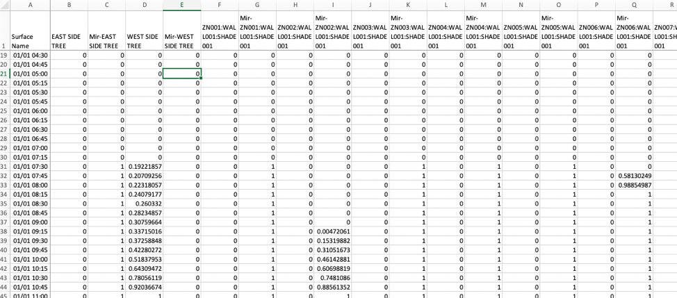
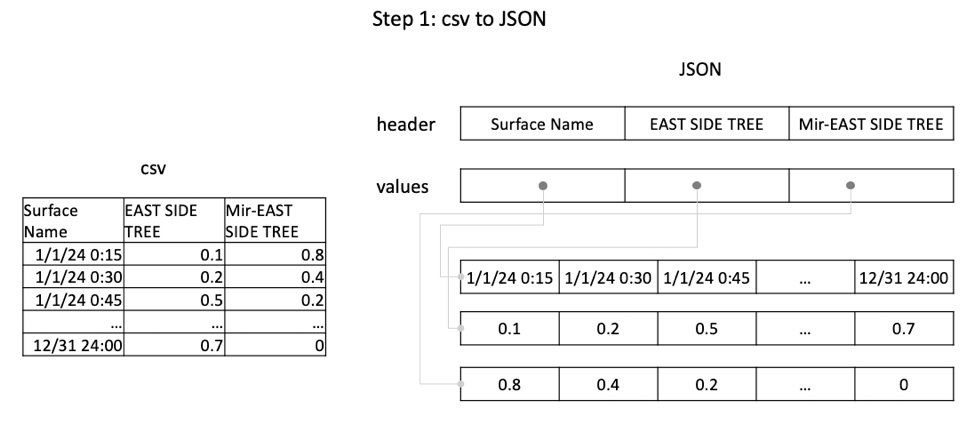
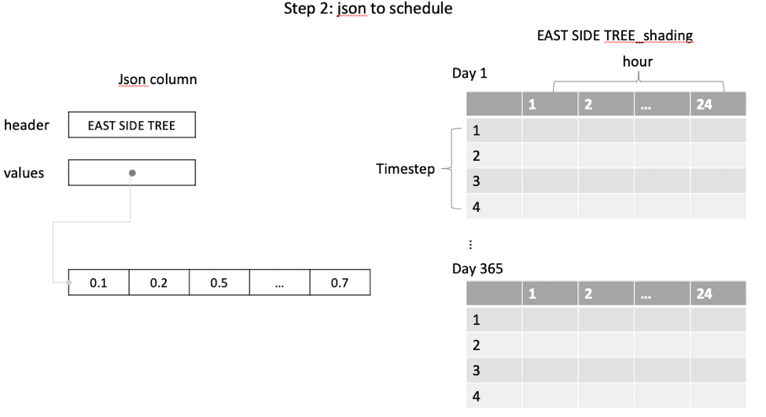
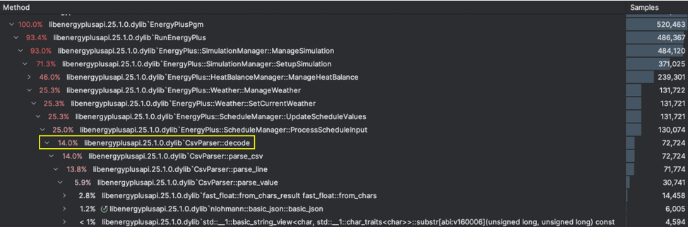

Enhancement of Sky/Ground View Factor and Shading Fraction Overwrite
================

**Yujie Xu, Tianzhen Hong**

**Lawrence Berkeley National Laboratory***

 - Original Date: Nov 7, 2024
 - Modified Date: Jan 23, 2025

## Justification for Feature Update

EnergyPlus allows modelers to input shading fractions for exterior surfaces using a CSV-format schedule, but modelers cannot override the surface view factors to the ground/horizon or the sky. This feature aims to facilitate the use of an external file to overwrite surface view factors to the ground and sky, similar to using Schedule:File:Shading to overwrite shading fractions. Further, for a large EnergyPlus simulation model, the external CSV schedule file could become extremely large and slow to parse. Another proposed improvement was to enhance the performance of shading fraction overwrites for large models. However, through benchmarking, we’ve established that the current csv parser performs decently well.

## Overview ##

### Sky and ground view factor overwrite in EnergyPlus ###

The sky and ground view factors of a specific surface can be overwritten using the SurfaceProperty:LocalEnvironment object, by defining a SurfaceProperty:SurroundingSurfaces object with the desired view factor values. This object is then referenced in the “Surrounding Surfaces Object Name” of the “SurfaceProperty:LocalEnvironment”. The current approach cannot input a time-varying view factor. Furthermore, defining view factors for multiple surfaces is tedious.

    SurfaceProperty:LocalEnvironment,
      LocEnv:Zn005:Wall002,    !- Name
      Zn005:Wall002,           !- Exterior Surface Name
      ,                        !- External Shading Fraction Schedule Name
      SrdSurfs:Zn005:Wall002,  !- Surrounding Surfaces Object Name
      ;                        !- Outdoor Air Node Name

    SurfaceProperty:SurroundingSurfaces,
      SrdSurfs:Zn005:Wall002,  !- Name
      0.1,                     !- Sky View Factor
      ,                        !- Sky Temperature Schedule Name
      ,                        !- Ground View Factor
      ,                        !- Ground Temperature Schedule Name
      SurroundingSurface1,     !- Surrounding Surface 1 Name
      0.5,                     !- Surrounding Surface 1 View Factor
      Surrounding Temp Sch 2,  !- Surrounding Surface 1 Temperature Schedule Name
      SurroundingSurface2,     !- Surrounding Surface 2 Name
      0.4,                     !- Surrounding Surface 2 View Factor
      Surrounding Temp Sch 2;  !- Surrounding Surface 2 Temperature Schedule Name

The “SurfaceProperty:GroundSurfaces” can also define ground view factors. An example is shown as follows. This object can define ground view factors for multiple surfaces, although as a single value, not time-varying.

    SurfaceProperty:GroundSurfaces,
      GndSurfs:Zn004:Wall001,  !- Name
      GndSurfs:Grass,          !- Ground Surface 1 Name
      0.2,                     !- Ground Surface 1 View Factor {dimensionless}
      GndSurfs:GrassTemp,      !- Ground Surface 1 Temperature Schedule Name
      GndSurfs:GrassRefl,      !- Ground Surface 1 Reflectance Schedule Name
      GndSurfs:Parking,        !- Ground Surface 2 Name
      0.2,                     !- Ground Surface 2 View Factor {dimensionless}
      GndSurfs:ParkingTemp,    !- Ground Surface 2 Temperature Schedule Name
      GndSurfs:ParkingRefl,    !- Ground Surface 2 Reflectance Schedule Name
      GndSurfs:Pond,           !- Ground Surface 3 Name
      0.1,                     !- Ground Surface 3 View Factor {dimensionless}
      GndSurfs:PondTemp,       !- Ground Surface 3 Temperature Schedule Name
      GndSurfs:PondRefl;       !- Ground Surface 3 Reflectance Schedule Name

The view factors are stored in these variables: `state.dataSurface->Surface(WinSurf).ViewFactorSky` and `
    state.dataSurface->Surface(WinSurf).ViewFactorGround`.

### Shading fraction overwrite in EnergyPlus ###

EnergyPlus can perform shading fraction overwrite with schedules in external files using two objects: “Schedule:File:Shading” and “SurfaceProperty:LocalEnvironment”. The former specifies the shading fraction time series for multiple surfaces. The latter is for one surface.

The following is an example from the “SolarShadingTest_ImportedShading.idf”, using “Schedule:File:Shading” object.

    Schedule:File:Shading,
      SolarShadingTest_Shading_Data.csv;  !- File Name

In the shading data csv file, each row is a timestamp and each column represents a surface, the values in each cell represent the shading fraction for each surface at each time stamp. If a surface is not present, then its value will be set to 1 by default (no shading). All timesteps in a year should be present.

 Figure 1. Snapshot of “SolarShadingTest_Shading_Data.csv” providing shading fraction time series data to “SolarShadingTest_ImportedShading.idf”

The following is an example from the input file “SolarShadingTest_ExternalFraction.idf”, using the “SurfaceProperty:LocalEnvironment” object to overwrite the shading fraction of one surface, indicated in the “Exterior Surface Name” field. The input file format is the same as the one used in the “Schedule:File:Shading” object, except that only one column in the data file is used in the overwrite.

    SurfaceProperty:LocalEnvironment,
      LocEnv:EAST SIDE TREE,   !- Name
      EAST SIDE TREE,          !- Exterior Surface Name
      ExtShadingSch:EAST SIDE TREE,  !- External Shading Fraction Schedule Name
      ,                        !- Surrounding Surfaces Object Name
      ;                        !- Outdoor Air Node Name

    Schedule:File,
      ExtShadingSch:EAST SIDE TREE,  !- Name
      Fraction,                !- Schedule Type Limits Name
      SolarShadingTest_Shading_Data.csv,  !- File Name
      2,                       !- Column Number
      1,                       !- Rows to Skip at Top
      ,                        !- Number of Hours of Data
      ,                        !- Column Separator
      ,                        !- Interpolate to Timestep
      15,                      !- Minutes per Item
      ;                        !- Adjust Schedule for Daylight Savings

There are two main steps in the csv parsing:
- Step 1: csv data is parsed into a nlohmann::json object
- Step 2: each column (surface) is converted into a schedule object.

In step 1, the parsing is conducted in csvParser.decode(.), and the parsed result is stored in `schedule_file_shading_result->second`.

    CsvParser csvParser;
    skiprowCount = 1; // make sure to parse header row only for Schedule:File:Shading
    auto it = state.dataScheduleMgr->UniqueProcessedExternalFiles.emplace(state.files.TempFullFilePath.filePath,
    csvParser.decode(schedule_data, ColumnSep, skiprowCount));
    …
    schedule_file_shading_result = it.first;  // <- result stored here, in “schedule_file_shading_result->second”

In `CsvParser::parse_csv`, it calls parse_csv(csv, index), which creates a JSON object, with two elements, “header” and “values”
`json root = {{"header", json::array()}`, `{"values", json::array()}};`
- each element of “header” is a column header in the csv
- each element of “values” is a vector of JSON object. Each vector holds the value of a specific column in the JSON
- “headers” and “values” have the same number of elements
- the timestamp column is not used in parsing, the ordering of the values in the column is based on its row index
- `parse_header(.)` will parse scan the first row in the csv file token by token and append values to the “header” JSON array
- before column values, a space of 8764 * 4 is reserved for each element in “values”.
- `parse_line(.)` will scan non-header rows in the csv one by one from top to bottom, and append the parsed cell values to the corresponding vector in “values”

 Figure 2. schematic diagram of step 1 using a toy example

In step 2, a schedule object is created for each surface named <surfaceName>_shading. Each schedule object contains a weekly schedule that points to day schedules, each of which stores the actual time series values in each corresponding day.

 Figure 3. schematic diagram of step 2 using a toy example

The shading fraction value is read here from the schedules.

    ExtShadingSchedNum = ScheduleManager::GetScheduleIndex(state, state.dataSurface->Surface(SurfNum).Name + "_shading");
    if (ExtShadingSchedNum != 0) {
        state.dataSurface->Surface(SurfNum).SurfSchedExternalShadingFrac = true;
        state.dataSurface->Surface(SurfNum).SurfExternalShadingSchInd = ExtShadingSchedNum;
    } else {
        …
    }

The shading fraction schedule overwrite happens here

    if ((state.dataSysVars->shadingMethod == ShadingMethod::Scheduled || state.dataSysVars->shadingMethod == ShadingMethod::Imported) &&
    !state.dataGlobal->DoingSizing && state.dataGlobal->KindOfSim == Constant::KindOfSim::RunPeriodWeather) {
        for (int SurfNum = 1; SurfNum <= s_surf->TotSurfaces; ++SurfNum) {
        if (s_surf->Surface(SurfNum).SurfSchedExternalShadingFrac) {
            state.dataHeatBal->SurfSunlitFrac(iHour, iTimeStep, SurfNum) =
            LookUpScheduleValue(state, s_surf->Surface(SurfNum).SurfExternalShadingSchInd, iHour, iTimeStep);
        } else {
            state.dataHeatBal->SurfSunlitFrac(iHour, iTimeStep, SurfNum) = 1.0;
        }
            ...
        }
    }

### Benchmarking of the shading fraction overwrite ###

Using the profiling tool in CLION, we can see the csv to intermediate JSON step contributes to 14% of the runtime.

 Figure 4. profiling results

We found the CSV to JSON takes 3-4 times longer to execute than the JSON to schedule step, for both a moderate-sized model with 100 surfaces and a large model with 10,000+ surfaces.

|                                         | Test file: SolarShadingTest_Shading_Data.csv with SolarShadingTest_ImportedShading.idf | Test file: SolarShadingTest_Shading_Data_NewSurf.csv with SolarShadingTest_ImportedShading_NewSurf.idf |
|-----------------------------------------|--|--------------------------------------------------------------------------------------------------------|
| \# surfaces                             | 113 | 10113 |
| \# rows	                                | 35040 (8760 x 4) |35040 (8760 x 4)|
| Step 1: CSV to JSON (csvParser.decode)	 | 0.0913  s (1 day: 26%, 1 year: 2%) | 8.3953  s (1 day: 24%, 1 year: 7%)|
| Step 2: JSON to schedule	0.0257  s      |(1 day: 7%, 1 year: 1%)	2.8716  s |(1 day: 8%, 1 year: 2%)|
| RunEnergyPlus 1 day                     | 0.00522 s|35.2565 s|
| RunEnergyPlus 1 year                    | 	3.83s|120.13  s|

 Table 1. Runtime of the two steps in parsing csv, relative to a 1-day and a 1-year simulation

| Optimization type          | Optimization action | Time taken |
|----------------------------|---------------------|------------|
| File format	               |baseline (csv format)|7.1839   s |
|                            |JSON	|28.5520  s|
|                            |Cbor	|18.1254  s|
|                            |Parquet|	1.2233   s|
| Reduce input data quantity |Cell value round to 2 digit|7.0618   s|
|                            |Keep only daytime value|6.9803   s|

 Table 2. runtime comparison of input optimization

Note that the JSON and cbor format in the benchmarking is as follows, where the keys are column names and values are arrays of the corresponding column content.

    {'Surface Name’:
    ['01/01 13:00', '01/01 13:15', '01/01 13:30', '01/01 13:45', '01/01 14:00', '01/01 14:15', '01/01 14:30', '01/01 14:45', '01/01 15:00', '01/01 15:15', '01/01 15:30', '01/01 15:45', '01/01 16:00', '01/01 16:15’],
    'EAST SIDE TREE’:
    [0.96107882, 0.81971099, 0.66919672, 0.5320864, 0.4412199, 0.38629316, 0.3483646, 0.31703278, 0.29047078, 0.26746, 0.24715273, 0.22894154, 0.21237744, 0.19712376],
    'Mir-EAST SIDE TREE’:
    [0, 0, 0, 0, 0, 0, 0, 0, 0, 0, 0, 0, 0, 0]}

We also tested out a series of existing c++ csv parsing libraries. The list is compiled according to AI tools like ChatGPT, perplexity, recommendations from Jason Glazer, and this list: https://cpp.libhunt.com/fast-cpp-csv-parser-alternatives

- [fast-cpp-csv-parser](https://github.com/ben-strasser/fast-cpp-csv-parser): this library needs the number of columns to be known at compile time. Similar to the functionality of SQL select col1,col2,col3 from my_file.csv
- [simdcsv](https://github.com/geofflangdale/simdcsv): the code on the master branch can’t build on arm64 apple. There’s a fix in a PR (https://github.com/geofflangdale/simdcsv/pull/9/commits/d309061f54e7d5f38e67920a729f3e98548089db). However, there are no examples of how to use it. Too mysterious to work with. No active development within the past 4 years, maybe not maintained.
- [csv-parser](https://github.com/vincentlaucsb/csv-parser): see table below, worse than the current reader
- [Rapidcsv](https://github.com/d99kris/rapidcsv): see table below, worse than the current reader
- [lazycsv](https://github.com/ashtum/lazycsv): see table below, better in very small files, but worse than current reader in moderate to larger files
- [nvparser](https://github.com/antonmks/nvParse): GPU-based, but the last update was 9 years ago, probably not maintained
- [csv](https://github.com/p-ranav/csv): repo is archived
- [csvstream](https://github.com/awdeorio/csvstream/): see table below, worse than the current reader
- [zsv+lib](https://github.com/liquidaty/zsv/tree/main): have trouble getting the API to work

| C++ csv parser libraries	 | 2 surfaces  | 100 surfaces | 1000 surfaces |10,000+ surfaces|
|---------------------------|-------------|--------------|---------------|-|
|baseline	| 0.002854 s	 | 0.07146.  s  | 0.700758 s	   | 7.58   s |
|csv-parser	| 0.011192 s	 | 0.199104 s   | 1.93414.  s   |	22.88 s|
|Rapidcsv	| 0.00522   s | 0.235737 s   | 2.728705 s	   |30.26 s   |
|lazycsv	| 0.001144 s	 | 0.447252 s   | 47.763254s	   | -        |
|csvstream	| | |               |15.01 s|

 Table 3. runtime comparison of using general-purpose csv parsers

## Approach

### View factor overwrite ###

To allow for view factor overwrite, we will add a `Schedule:File:SkyViewFactor` and `Schedule:File:GroundViewFactor` object to overwrite the sky view factor for multiple surfaces. See section "IDD Object changes" for details on these added objects.

## Testing/Validation/Data Source(s)

The view factor overwrite feature will be tested with a test file derived from 1ZoneUncontrolled_win_1.idf.
The shading fraction investigation will be tested and demonstrated with a test file derived from
SolarShadingTest_ImportedShading.idf and SolarShadingTest_ExternalFraction.idf

## IDD Object changes

The following objects will be added to specify time-varying sky view factors and ground view factors for one or multiple surfaces. If the ground and view factors are also specified in `SurfaceProperty:SurroundingSurfaces` or `SurfaceProperty:GroundSurfaces`, the values specified in the external csv file will take precedence.

    Schedule:File:SkyViewFactor,
      \min-fields 1
      \memo A Schedule:File:SkyViewFactor points to a CSV file that has 8760-8784
      \memo hours of sky view factor data for all or some of the exterior surfaces.
      \unique-object
      A1 ; \field File Name
      \note The name of the file that writes all sky view factor data.
      \required-field
      \retaincase

    Schedule:File:GroundViewFactor,
      \min-fields 1
      \memo A Schedule:File:GroundViewFactor points to a CSV file that has 8760-8784
      \memo hours of sky view factor data for all or some of the exterior surfaces.
      \unique-object
      A1 ; \field File Name
      \note The name of the file that writes all ground view factor data.
      \required-field
      \retaincase

## Proposed additions to Meters:

N/A

## Proposed Report Variables:

N/A
 
## References
