=====================
EnergyPlus Essentials
=====================

Introduction
============

The following background on building energy modeling (BEM) will provide
a foundation before learning the essentials of EnergyPlus. If you are
already familiar with BEM, you may wish to skip to Section 1.4
describing the EnergyPlus QuickStart Guide.

What is BEM?
------------

According to the `BEM
Library <https://www.bemlibrary.com/index.php/owners-managers/introduction/what-bem/>`__:

   “Building Energy Modeling (BEM) is the practice of using
   computer-based simulation software to perform a detailed analysis of
   a building’s energy use and energy-using systems. The simulation
   software works by enacting a mathematical model that provides an
   approximate representation of the building. BEM includes
   whole-building simulation as well as detailed component analysis
   utilizing specialized software tools that address specific concerns,
   such as moisture transfer through building materials, daylighting,
   indoor air quality, natural ventilation, and occupant comfort. BEM
   offers an alternative approach that encourages customized, integrated
   design solutions, which offer deeper savings. Using BEM to compare
   energy-efficiency options directs design decisions prior to
   construction. It also guides existing building projects to optimize
   operation or explore retrofit opportunities.”

Some other terms that are used to describe the same topic are:

-  Building Simulation

-  Building Performance Simulation

-  Building Energy Simulation

-  Building Performance Modeling

Somewhat confusing, the term “model” can refer to both the specific
building being described and analyzed as well as referencing the
software for implementing a specific component of the building such as a
wall or chiller.

To learn more about building energy modeling consider reviewing the
following resources:

-  `2017 ASHRAE Handbook -
   Fundamentals <https://www.ashrae.org/technical-resources/ashrae-handbook/description-2017-ashrae-handbook-fundamentals>`__
   Chapter 19 Energy Estimating and Modeling Methods

-  `BEM Library <https://www.bemlibrary.com/>`__

-  `IBPSA <http://www.ibpsa.org/?page_id=695>`__,
   `IBPSA-USA <https://www.ibpsa.us/videos/all>`__, and
   `YouTube <https://www.youtube.com/results?search_query=building+energy+modeling>`__
   videos

-  `Numerous
   books <https://www.amazon.com/s/ref=nb_sb_noss_2?url=search-alias%3Daps&field-keywords=building+energy+modeling>`__

-  ASHRAE `Standard
   209 <https://www.techstreet.com/ashrae/standards/ashrae-209-2018?gateway_code=ashrae&product_id=2010483>`__
   Energy Simulation Aided Design for Buildings Except Low-Rise
   Residential Buildings

-  Study materials for the ASHRAE Building Energy Modeling Professional
   (`BEMP <https://www.ashrae.org/professional-development/ashrae-certification/certification-types/bemp-building-energy-modeling-professional-certification>`__)
   or AEE Building Energy Simulation Analyst
   (`BESA <https://www.aeecenter.org/certifications/certifications/certified-building-energy-simulation-analyst>`__)
   professional certifications

Building energy modeling is necessary to understand the overall energy
consumption in buildings, because, the energy flows in buildings can be
very complicated. The heat flow through walls is determined not just by
the area and the temperatures, but the mass characteristics of the walls
may result in heat flowing out of a wall several hours after it has
flowed in. The constantly changing temperature on the outside of the
wall and the less frequent but often large step changes in thermostat
setpoints between day and night operation for the inside of the building
make the direction of the heat flow vary over time. Solar energy is
absorbed on the exterior wall and roof surfaces as well as entering
windows. The intensity of solar energy varies by the sun position for
each period of time over the day and over the year. Heat sources within
the building including people, office and other equipment, and lighting
include both heat that immediately impacts the air within (convective
heat) and heat that is absorbed by the surfaces and released slowly over
time (radiant heat). Lighting may be controlled by a sensor that turns
it on or off or changes its intensity based on the amount of natural
daylight that is entering the space through windows and skylights making
the heat generated from the lighting system change over time. Air
conditioning and heating systems come in a huge number of
configurations, and each one can be used with many different control
configurations based on the temperature or other conditions within each
space in the building, and ultimately their operation accounts for a
large portion of the energy consumed in a building. For these reasons
and more, what might first appear as something that can be calculated
with just a few formulas in a spreadsheet is instead a software program
and, in the case of EnergyPlus, with over 500,000 lines of code.

Questions that BEM can answer
-----------------------------

The most common questions that BEM can answer are:

-  If my building was made or operated differently, how would the
   required equipment capacity and energy consumption change?

-  Does my building comply with a building energy code or standard?

-  What kind of rating or how many points can I get in an environmental
   certification program?

-  Is my building operating as it was designed to?

-  What is a good target for energy consumption for my building?

These questions and more can occur at different times during the
life-cycle of a building, from before schematic design all the way
through the rest of the design process, and into the operation of the
building

The Design Process and BEM 
---------------------------

Building energy modeling can be used throughout the design process for a
new building or when considering updates to existing buildings. It can
also be used later in the life-cycle of a building related to comparing
actual operation of the building with the predicted operation. ASHRAE
`Standard
209 <https://www.techstreet.com/ashrae/standards/ashrae-209-2018?gateway_code=ashrae&product_id=2010483>`__
titled “Energy Simulation Aided Design for Buildings Except Low-Rise
Residential Buildings” is a critical document in how to apply building
energy modeling. It describes a methodology to apply building energy
modeling to the design and was created to define reliable and consistent
procedures that advance the use of timely energy modeling to quantify
the impact of design decisions at the point in time which they are made.
The standard includes different “Modeling Cycles” for different stages
of using building energy modeling during the life-cycle of the building:

-  Modeling Cycle #1 – Simple Box Modeling

-  Modeling Cycle #2 – Conceptual Design Modeling

-  Modeling Cycle #3 – Load Reduction Modeling

-  Modeling Cycle #4 – HVAC System Selection Modeling

-  Modeling Cycle #5 – Design Refinement

-  Modeling Cycle #6 – Design Integration and Optimization

-  Modeling Cycle #7 – Energy Simulated-Aided Value Engineering

-  Modeling Cycle #8 – As-Designed Energy Performance

-  Modeling Cycle #9 – Change Orders

-  Modeling Cycle #10 – As-Built Energy Performance

-  Modeling Cycle #11 – Postoccupancy Energy Comparison

In addition, it has information about how to integrate climate and site
analysis, benchmarking, energy charrettes (a meeting of the stakeholders
to discuss goals and design strategies) and the energy performance goals
of the owners project requirements into the design process when using
building energy modeling.

EnergyPlus QuickStart Guide
---------------------------

Don’t be intimidated by the apparent complexity of EnergyPlus; you can
get started using EnergyPlus quickly using the QuickStart Guide which is
part of the documentation. It shows you how you can use just an input
file and some output files to start seeing results quickly. The building
description, the detecting and solving of errors, and the most common
primary outputs are found in the IDF input file, the Table.HTML output
file and the .ERR diagnostics file. Starting with these three files and
branching out to others as needed is a good strategy for learning
EnergyPlus.

EnergyPlus Capabilities
-----------------------

According to the `energyplus.net web site <https://energyplus.net/>`__
(as of January 2019):

   “EnergyPlus is a whole building energy simulation program that
   engineers, architects, and researchers use to model both energy
   consumption—for heating, cooling, ventilation, lighting and plug and
   process loads—and water use in buildings. Some of the notable
   features and capabilities of EnergyPlus include:

-  Integrated, simultaneous solution of thermal zone conditions and HVAC
   system response that does not assume that the HVAC system can meet
   zone loads and can simulate un-conditioned and under-conditioned
   spaces.

-  Heat balance-based solution of radiant and convective effects that
   produce surface temperatures, thermal comfort, and condensation
   calculations.

-  Sub-hourly, user-definable time steps for interaction between thermal
   zones and the environment; with automatically varied time steps for
   interactions between thermal zones and HVAC systems. These allow
   EnergyPlus to model systems with fast dynamics while also trading off
   simulation speed for precision.

-  Combined heat and mass transfer model that accounts for air movement
   between zones.

-  Advanced fenestration models including controllable window blinds,
   electrochromic glazings, and layer-by-layer heat balances that
   calculate solar energy absorbed by window panes.

-  Illuminance and glare calculations for reporting visual comfort and
   driving lighting controls.

-  Component-based HVAC that supports both standard and novel system
   configurations.

-  A large number of built-in HVAC and lighting control strategies and
   an extensible runtime scripting system for user-defined control.

-  Functional Mockup Interface import and export for co-simulation with
   other engines.

-  Standard summary and detailed output reports as well as user
   definable reports with selectable time-resolution from annual to
   sub-hourly, all with energy source multipliers.”

In addition:

-  ASCII text-based weather, input, and output files that include hourly
   or sub-hourly environmental conditions, and standard and user
   definable reports, respectively.

-  Transient heat conduction through building elements such as walls,
   roofs, floors, etc. using conduction transfer functions.

-  Thermal comfort models based on activity, inside dry-bulb
   temperature, humidity, etc.

-  Anisotropic sky model for improved calculation of diffuse solar on
   tilted surfaces.

-  Atmospheric pollution calculations that predict CO2, SOx, NOx, CO,
   particulate matter, and hydrocarbon production for both on-site and
   remote energy conversion.

-  EnergyPlus can be used for for building load calculations and sizing
   equipment and uses the heat balance method recommended in the `ASHRAE
   Handbook
   Fundamentals <https://www.ashrae.org/technical-resources/ashrae-handbook>`__.
   Proper sizing of equipment without oversizing, generally saves energy
   as the equipment is operated nearer to optimal loads.

-  EnergyPlus runs on Windows, MacOS, and Linux computers.

Integration of Loads, Systems, and Plants: One of the strong points of
EnergyPlus is the integration of all aspects of the simulation—loads,
systems, and plants. System and plant output are allowed to directly
impact the building thermal response rather than calculating all loads
first, then simulating systems and plants. The simulation is coupled
allowing the designer to more accurately investigate the effect of
undersizing fans and equipment and what impact that might have on the
thermal comfort of occupants within the building.

Open Source
-----------

`EnergyPlus <https://energyplus.net/>`__ is an `Open
Source <https://opensource.org/>`__ program so all the `source
code <https://github.com/NREL/EnergyPlus>`__ is available to inspect and
modify. If you are interested in how calculations are performed and the
`Engineering Reference <https://energyplus.net/documentation>`__ does
not provide enough details to you, you can review the source code
itself. `Instructions to build the
code <https://github.com/NREL/EnergyPlus/wiki/BuildingEnergyPlus>`__
(compile the source code into an executable application) are available
in the source code repository wiki if you see something that needs to be
enhanced or fixed, please also see the `contribution
policy <https://energyplus.net/contributing>`__.

Brief History
-------------

EnergyPlus has been under development since 1997 and was first released
in 2001. EnergyPlus has its roots in both the BLAST and DOE–2 programs.
BLAST (Building Loads Analysis and System Thermodynamics) and DOE–2 were
both developed and released in the late 1970s and early 1980s as energy
and load simulation tools. BLAST was developed by the `Construction
Engineering Research Laboratory
(CERL) <https://www.erdc.usace.army.mil/Locations/CERL/>`__ and `the
University of Illinois <https://illinois.edu/>`__ while DOE-2 was
developed by `Berkeley Lab <https://www.lbl.gov/>`__ and many others.
Their intended audience is a design engineer or architect that wishes to
size appropriate HVAC equipment, develop retrofit studies for life
cycling cost analyses, optimize energy performance, etc. Born out of
concerns driven by the energy crisis of the early 1970s and recognition
that building energy consumption is a major component of the American
energy usage statistics, the two programs attempted to solve the same
problem from two slightly different perspectives. In the late 1990s,
concern about limitations of both BLAST and DOE-2 as well as difficulty
in maintaining the old code bases prompted combining the development
efforts for a new program called EnergyPlus. EnergyPlus was originally
written in Fortran, in 2014 it was converted to C++. It was developed as
a simulation engine, and many `graphical user
interfaces <https://www.buildingenergysoftwaretools.com/>`__ utilize it.

Documentation
-------------

The EnergyPlus documentation is currently included in the installation
in the “Documentation” folder as PDFs. It is also available as `PDFs
online <https://energyplus.net/documentation>`__ and from third parties
that have generated HTML documentation from the source. Using search in
the documentation is critical to finding the information needed. Some of
the documentation PDFs are very large, so searching is a good way to
find specific information about a topic or an input object. The
documentation includes:

-  QuickStart Guide: Contains a brief high-level overview of EnergyPlus
   and get you up and running quickly with the program

-  Input Output Reference: Contains a thorough description of the
   various input and output files related to EnergyPlus, the format of
   these files, and how the files interact and interrelate.

-  Output Details and Examples: Contains details on output from
   EnergyPlus. It also addresses the reference data sets that are
   included.

-  Auxiliary Programs: Contains information for the auxiliary programs
   that are part of the EnergyPlus package. For example, this document
   contains the user manual for the Weather Converter program,
   descriptions on using Ground Heat Transfer auxiliary programs with
   EnergyPlus, and other assorted topics.

-  Engineering Reference: Provides more in-depth knowledge into the
   theoretical basis behind the various calculations contained in the
   program including algorithm descriptions.

-  Application Guide for EMS: Provides an in-depth look at the Energy
   Management System (EMS) feature which provides a way to develop
   custom control and modeling routines.

-  External Interface(s) Application Guide: Contains information
   specific to using the external interface feature of EnergyPlus to
   connect other simulation systems.

-  Plant Application Guide: Details the methods for simulating chilled
   and hot water plant systems within EnergyPlus.

-  Using EnergyPlus for Compliance Guide: Contains information specific
   to using EnergyPlus in compliance and standard rating systems.

-  Tips & Tricks for Using EnergyPlus: Contains short tips and tricks
   for using various parts of EnergyPlus.

Example Files 
--------------

Many hundreds of example files come with EnergyPlus, and they are in the
ExampleFiles folder from the installation. The
\\ExampleFiles\\ExampleFiles.html lists each one and includes the name,
a description (scroll all the way to the right) and lots of information
such as the floor area and whether certain types of input objects are
included in the file. Often searching through this file is a good way to
find the proper example file to learn about a feature. Another method is
the \\ExampleFiles\\ExampleFiles-ObjectsLink.html file which lists every
type of input object that EnergyPlus uses and then the first three files
that use that input object. It is possible that many other files also
use a particular input object so if the first three files do not help, a
text search of files in the ExampleFiles folder may find more.

The EnergyPlus Ecosystem 
=========================

Current Interfaces 
-------------------

EnergyPlus is often used directly using the text file input (IDF or
epJSON) and various output file formats along with the utilities that
come with the installation package. More information on that can be
found in section `[sec:Using-EnergyPlus] <#sec:Using-EnergyPlus>`__. In
addition, EnergyPlus is often the simulation engine for graphical user
interfaces. To see a list, see the `BEST (Building Energy Software
Tools) Directory <https://www.buildingenergysoftwaretools.com/>`__ that
is operated by `IBPSA-USA <https://www.ibpsa.us/>`__.

Approaches to Implement Measures 
---------------------------------

In the terminology used within the building energy modeling industry
“measures,” sometimes called energy conservation measures (ECMs) or
energy efficiency measures (EEMs), are when alternative configurations
of a building are considered and simulated and compared with the
original building model. Measures include added wall or roof insulation,
lower internal lighting power, higher efficiency heating and cooling
equipment, and many others. When using EnergyPlus within a graphical
user interface, that interface often provides a way to implement various
measures. When not working within a graphical user interface, users have
several options for implementing measures.

For a specific building input file, a copy of the input file can be made
and then modified to reflect the measure. This is an easy approach
initially, but since the original building model might change, it means
making the change in the file that reflects the measure. When many
measures are being considered, this duplicative editing can be
inefficient and prone to errors. In addition, the measure cannot be
easily applied to a different building energy model without again
editing another set of files duplicating the original effort. Due to
this, it is very common for some type of scripting to be used so that
measures can be applied to the original building model and other models
of other buildings reliably and quickly. Scripting in this approach
means to apply some type of programming language to the task of
modifying files.

EnergyPlus includes, with the installation package, two methods of
implementing measures EP-Macro and the ParametricPreprocessor. EP-Macro
is similar to the C language pre-processor and allows for portions of
the file to be included or excluded, portions of other files to be
included when desired, and for specific entries that are normally fixed
values to change programmatically. EP-Macro is documented in the
AuxiliaryPrograms documentation. A file with lines starting “##” or with
the “imf” file extension is likely to be a file using EP-Macro commands.

The EnergyPlus ParametricPreprocessor uses special input objects in
EnergyPlus to set values for any field in any other input object for a
series of simple options. This is briefly described in the
AuxiliaryPrograms documentation, and more details are present in the
InputOutputReference under the section on “Parametric Objects.” The
ParametricPreprocessor approach is very straight forward, however it has
limits in the flexibility that it provides. It is suitable for
implementing measures related to internal loads, constructions, and
simple efficiency changes but is probably not the appropriate tool for
more complicated measures.

A
`paper <https://www.ashrae.org/File%20Library/Conferences/Specialty%20Conferences/2018%20Building%20Performance%20Analysis%20Conference%20and%20SimBuild/Papers/C043.pdf>`__
that describes various other approaches to scripting was written during
the 2018 ASHRAE/IBPSA-USA Building Performance Conference and SimBuild.

Parametric Analysis Tools 
--------------------------

When just implementing a simple measure or even a series of measures is
not enough, a parametric analysis tool may be appropriate. These tools
allow the exploration throughout the range of variables (such as the
thickness of insulation in the roof or the efficiency of a boiler) to
see the impacts of optimization. While many of the approaches used to
implement measures described previously may also be used for parametric
analysis, a few specific tools have been developed. To see a list, see
the `BEST (Building Energy Software Tools)
Directory <https://www.buildingenergysoftwaretools.com/>`__ that is
operated by `IBPSA-USA <https://www.ibpsa.us/>`__.

Weather Files 
--------------

Weather files are available for many locations throughout the world.
Finding the right file that represents the weather in your specific
location can sometimes be a challenge. Often the closest weather
location is the best one to choose, but sometimes a site that is further
away may actually have the most similar weather. This is especially the
case in terrain that varies in elevation or when near large bodies of
water. Many weather files are available from both public and private
sources. The `EnergyPlus weather
file <https://energyplus.net/weather>`__ web site has many weather files
with `sources described <https://energyplus.net/weather/sources>`__.
That web site also has a `page with
links <https://energyplus.net/weather/simulation>`__ to many other sites
that provide weather files. The modeler must also choose between using a
typical year weather files or an actual year file. Typical year files,
such as TMY3 and IWEC are representative of long-term weather compiled
from 20-30 years of data. Actual year files contain a specific year of
weather data and generally used for calibration or verification studies
where the simulation results are compared to actual utility bills or
other measured data.

Co-Simulation and Linked Software
---------------------------------

The modelling of multi-domain, multi-physics, and multi-time scale
systems such as buildings is a challenge for building energy modelling
and simulation tools. In certain circumstances, it may be better for
modelling such systems to split the systems into multiple sub-systems,
model the individual sub-systems in the language or tool which is best
suited for the system’s domain, and use a master algorithm to link the
sub-systems for a so called “co-simulation.” In a nutshell,
co-simulation consists of the theory and techniques that enable the
simulation of a coupled system through the composition of simulators.
Each simulator is an input-output mock-up of a constituent system,
developed and provided by the team that is responsible for the
`sub-system <https://arxiv.org/abs/1702.00686>`__. The coupling of the
sub-systems is performed by a master algorithm which is responsible for
linking the sub-systems at run-time for data-exchange. EnergyPlus
implements three mechanisms to support co-simulation.

-  EnergyPlus implements the Building Controls Virtual Test Bed (
   `BCVTB <https://www.tandfonline.com/doi/abs/10.1080/19401493.2010.518631>`__)
   API. This API leverages the BCVTB to enable the co-simulation of
   EnergyPlus with various simulation programs such as
   `TRNSYS <http://www.trnsys.com/>`__,
   `ESP-r <http://www.esru.strath.ac.uk/Programs/ESP-r.htm>`__,
   `Radiance <http://radsite.lbl.gov/radiance/HOME.html>`__, or
   `DYMOLA <https://www.3ds.com/products-services/catia/products/dymola/>`__.

-  EnergyPlus provides an interface which allows it to import, link, and
   exchange data with simulation models which implement the Functional
   Mock-up Interface (FMI) for
   `co-simulation <https://www.tandfonline.com/doi/abs/10.1080/19401493.2013.808265>`__.
   Such models are called Functional Mock-up Units (FMUs). This feature
   allows for instance the integration and testing of
   `Simulink <https://www.mathworks.com/>`__ or
   `Modelica <https://www.modelica.org/>`__-based control algorithms
   which may not exist in EnergyPlus.

-  EnergyPlus itself can be exported as an FMU which implements the `FMI
   for
   co-simulation <https://simulationresearch.lbl.gov/wetter/download/2014_NouiduiWetter.pdf>`__.
   Such FMU can then be imported into any simulation engine which
   implements the FMI import interface for co-simulation. This feature
   is relevant for applications such as the development of building
   controls. For example, the building envelope of EnergyPlus may be
   exported as an FMU which in turn will be imported in a tool which is
   best suited for control development. In this use case, the FMU will
   be used as a boundary condition for control’s development.

Getting Help 
-------------

Several resources are available for getting help when using EnergyPlus:

-  `UnmetHours <https://unmethours.com/questions/>`__

-  `EnergyPlus Helpdesk <https://energyplushelp.freshdesk.com/>`__

-  `EnergyPlus_support mailing
   list <https://groups.yahoo.com/neo/groups/EnergyPlus_Support/info>`__

-  `Several organizations provide paid
   support <https://buildingenergysoftwaretools.com/?capabilities=Support+Services&keys=EnergyPlus>`__

Please do not post questions as issues on the EnergyPlus Github website.
Of course, if you are using a graphical user interface with EnergyPlus,
the vendor will provide direct support.

After reviewing this document and other pertinent documents that come
with EnergyPlus like the InputOutputReference, if additional training is
required, several sources are available:

-  `YouTube <https://www.youtube.com/results?search_query=energyplus>`__

-  University `course <https://energyplus.net/support>`__ teaching
   materials

-  Several
   `organizations <https://www.buildingenergysoftwaretools.com/?capabilities=Training+Services&keys=EnergyPlus>`__
   provide paid training

In addition, if you are using a graphical user interface, the vendor
probably also provides training.

Using EnergyPlus 
=================

Installing EnergyPlus
---------------------

Please see the EnergyPlus QuickStart Guide for instructions on how to
install EnergyPlus for your system.

Running EnergyPlus
------------------

EnergyPlus is a simulation engine, so it was designed to be an element
within a graphical user interface. However, it can be run standalone
without such an interface. There are several options for performing a
simulation with EnergyPlus:

-  Graphical user interface

-  Command line

-  EP-Launch

In each case, a building model will be simulated in combination with a
weather file for the appropriate building location.

Graphical User Interface
~~~~~~~~~~~~~~~~~~~~~~~~

When running an EnergyPlus simulation within a graphical user interface,
the exact method will vary depending on the specific program being used.
You should read the documentation for that software to understand how to
perform a simulation. In all cases, the interface will ultimately
generate an EnergyPlus idf or epjson input file, execute the EnergyPlus
simulation, and read the EnergyPlus output files to present results.

Command Line
~~~~~~~~~~~~

EnergyPlus can be used as a command line tool within a Terminal window
in Linux or MacOS or with the CMD prompt or PowerShell window under
Windows. Basic usage using the command line approach is well documented
in the QuickStart Guide. To learn more about the command line mode, you
can type:

::

   energyplus --help

when in the EnergyPlus folder. This will give the following display of
options:

::

   EnergyPlus, Version 9.6.0-ec0190a2fc
   Usage: energyplus [options] [input-file]
   Options:
     -a, --annual                 Force annual simulation
     -c, --convert                Output IDF->epJSON or epJSON->IDF, dependent on
                                  input file type
     -d, --output-directory ARG   Output directory path (default: current
                                  directory)
     -D, --design-day             Force design-day-only simulation
     -h, --help                   Display help information
     -i, --idd ARG                Input data dictionary path (default: Energy+.idd
                                  in executable directory)
     -j, --jobs ARG               Multi-thread with N threads; 1 thread with no
                                  arg.
     -m, --epmacro                Run EPMacro prior to simulation
     -p, --output-prefix ARG      Prefix for output file names (default: eplus)
     -r, --readvars               Run ReadVarsESO after simulation
     -s, --output-suffix ARG      Suffix style for output file names (default: L)
                                     L: Legacy (e.g., eplustbl.csv)
                                     C: Capital (e.g., eplusTable.csv)
                                     D: Dash (e.g., eplus-table.csv)
     -v, --version                Display version information
     -w, --weather ARG            Weather file path (default: in.epw in current
                                  directory)
     -x, --expandobjects          Run ExpandObjects prior to simulation
   --convert-only                 Only convert IDF->epJSON or epJSON->IDF,
                                  dependent on input file type. No simulation
   Example: energyplus -w weather.epw -r input.idf

EnergyPlus can be run by specifying a number of options followed by the
path to the input file. The file itself is usually in IDF (Input Data
File) format or epJSON format, but it may also be in IMF (Input Macro
File) format to be run with EPMacro using the --epmacro option. Each
option has a short form (a single-character preceded by a single dash,
e.g., -h) and a long form (a more descriptive string of characters
preceded by double dashes, e.g., --help). Several of these options are
commonly used including the weather, output-prefix, expandobjects, and
readvars options. The following are some examples of using the command
line options.

Pre-processing using EPMacro and ExpandObjects:

::

   energyplus -w weather.epw -m -x input.imf

Forcing design-day only simulations:

::

   energyplus -D input.idf

Giving all output files the prefix being the same as the input file
(building.idf) and placing them in a directory called output:

::

   energyplus -w weather -p building -d output building.idf

If no arguments are passed on the command line, EnergyPlus expects the
input and weather files to be located in the current working directory
and name in.idf (or in.epjson) and in.epw respectively.

EP-Launch
~~~~~~~~~

For users that want a simple way of selecting files and running
EnergyPlus, EP-Launch provides this and more. In addition, EP-Launch can
help open a text editor for the input and output files, open a
spreadsheet for the result files, a web browser for the tabular results
file, and start up a viewer for the selected drawing file. There are two
different versions of EP-Launch currently part of the EnergyPlus system.

The main screen of EP-Launch 2 is shown below:

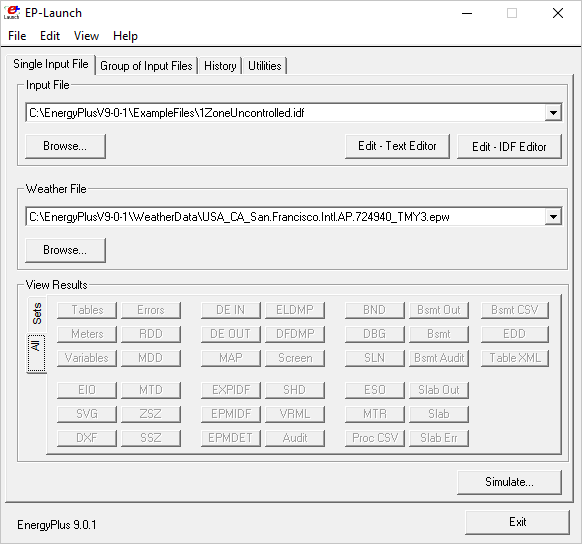

It is a Windows program only. EP-Launch 2 is included in the EnergyPlus
installation package when installing on Windows, so no additional steps
are needed to run it. It is located in the main “root” folder of
EnergyPlus, usually, a folder named EnergyPlusVx-x-x, where the x’s are
the version number.

In 2018, EP-Launch 3 was developed, and its main screen is shown below:

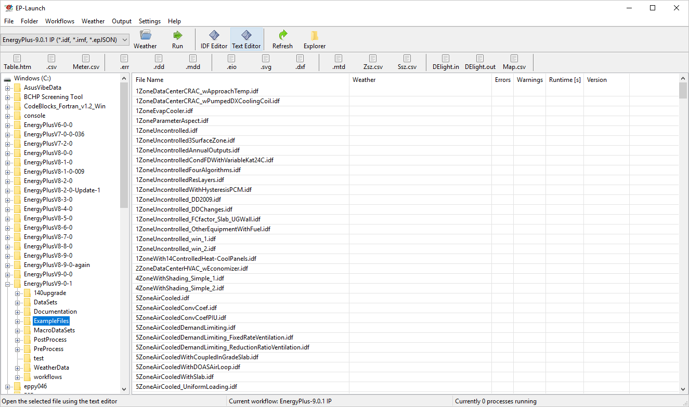

EP-Launch 3 is not part of the EnergyPlus installation package and needs
to be installed separately. It is also open source and is available from
`GitHub <https://github.com/NREL/EP-Launch>`__, and it is documented on
`readthedocs <https://ep-launch.readthedocs.io/en/latest/>`__ or in the
docs folder on GitHub. EP-Launch 3 works on Windows, MacOS, and Linux
systems and is written in Python.

While both EP-Launch 2 and EP-Launch 3 do many of the same functions,
the interface is quite different. For now, EP-Launch 2 allows groups of
files to be run together and has access to some utilities that the newer
version does not. EP-Launch 3 works across multiple platforms and is a
built from the ground up to be flexible and extensible so that
individuals can make their own workflows that run whatever programs they
need to run.

IDF and JSON syntax
-------------------

EnergyPlus has two different input file formats that can be used to
describe the building and system that is simulated. The file extensions
for the two formats are IDF and epJSON. For both input files, the
numeric inputs are in SI units (International System of Units often
called metric units).

IDF
~~~

The legacy file format is a text-based format that describes each input
object in series. Each input object starts with the type of input
object, and each value for each field follows in strict order separated
by commas. The end of the input object is indicated by a semi-colon.
Comments are indicated by an exclamation point “!” and anything after
this is ignored by EnergyPlus. Commonly, an input object is spread over
many lines in the file with one value for each field per line. The names
of each field are not required but are usually shown after the value and
the comma or semicolon as a special comment using “!-” as an indicator.
The input objects can be in any order. An example of an input object in
an IDF file is shown below:

::

     Building,
       Simple One Zone,   !- Name
       0,                 !- North Axis {deg}
       Suburbs,           !- Terrain
       0.04,              !- Loads Convergence Tolerance Value
       0.004,             !- Temperature Convergence Tolerance Value {deltaC}
       MinimalShadowing,  !- Solar Distribution
       30,                !- Maximum Number of Warmup Days
       6;                 !- Minimum Number of Warmup Days

The details of this example input object are not important, but the use
of commas, exclamation points, and the closing semi-colon are important.
The IDF format is currently the most commonly used format throughout the
EnergyPlus ecosystem of utilities and GUIs. The list of possible input
objects and fields is documented in the Energy+.idd file.

A variation on the IDF file format is the IMF file format which includes
macros that can be used for parametric analysis or file management
called EP-Macros. To learn more about macros see the Input Macros
chapter of the AuxiliaryPrograms document.

epJSON
~~~~~~

A new file format based on the industry standard
`JSON <https://www.json.org/>`__ format most often used to transmit data
to and from web servers and web-browser based applications. It is a
text-based file format. The JSON format has wide usage across many
industries and is supported in just about every modern programming
language. It is a field-value style format using brackets and colons to
indicate the hierarchy and commas to separate each field and value pair.
The input objects must appear grouped by the type of input object. The
list of possible input objects and fields is documented in the
Energy+.schema.epJSON file which uses
`json-schema <http://json-schema.org/>`__. The same input object shown
above in IDF format is shown below in epJSON format:

::

   {
       "Building": {
           "Simple One Zone: {
               "idf_max_extensible_fields": 0,
               "idf_max_fields": 8,
               "idf_order": 3,
               "loads_convergence_tolerance_value": 0.04,
               "maximum_number_of_warmup_days": 30,
               "minimum_number_of_warmup_days": 6,
               "north_axis": 0,
               "solar_distribution": "MinimalShadowing",
               "temperature_convergence_tolerance_value": 0.004,
               "terrain": "Suburbs"
           }
       }
   }

Converting between IDF and epJSON
~~~~~~~~~~~~~~~~~~~~~~~~~~~~~~~~~

While the IDF and epJSON file formats are quite different, they contain
the same information, and either may be used. In general, if producing
EnergyPlus input files using a programming language, the epJSON format
might make more sense while, at this point, if producing IDF files using
a GUI, they are likely to use the IDF format.

EnergyPlus, when used on the command line, can convert from IDF to
epJSON and from epJSON to IDF using the -c or --convert option.

There is also a separate conversion utility ConvertInputFormat.exe in
the root EnergyPlus folder. It takes the name of an IDF or epJSON input
file (with extension) as an argument. For additional options, type

::

   ConvertInputFormat --help.

when in the EnergyPlus folder. This will give the following display of
options:

::

   Usage: ConvertInputFormat [OPTIONS] input_file [input_file ..]
   Options:
     -f, --format ARG                 Output format.
                                      Default means IDF->epJSON or epJSON->IDF
                                      Select one (case insensitive):
                                      default,idf,epjson,json,cbor,msgpack,ubjson,bson
     -h,   -help,   --help, --usage   Display usage instructions.
     -i, --input ARG                  Text file with list of input files to convert
                                      (newline delimited)
     -j ARG                           Number of threads
     -n, --noHVACTemplate             Do not convert HVACTemplate objects.
     -o, --output ARG                 Output directory. Will use input file
                                      location by default.
     -v, --version                    Display version information
   Example: ConvertInputFormat in.idf

On Windows, you can also drag a file (IDF or epJSON) onto
ConvertInputFormat.exe. Note that ConvertInputFormat is version-specific
and will not convert an epJSON file that is not the same version.

There are three groups of special input objects which are preprocessor
commands: GroundHeatTransfer:\*, HVACTemplate:\* Parametric:\*.
ConverInputFormat converts HVACTemplate objects. EnergyPlus does not
convert any of these.

Creating and Editing Input Files
--------------------------------

Since both the IDF and epJSON file formats are text formats, a simple
text editor may be used to edit them. Even if not regularly used, a good
text editor is an important application to have when working with
EnergyPlus. There are many different `text
editors <https://en.wikipedia.org/wiki/Comparison_of_text_editors>`__,
and a few have special features related to the IDF format such as syntax
highlighting including
`Atom <https://github.com/bigladder/atom-language-energyplus>`__,
`Notepad++ <https://github.com/jmarrec/notepad>`__, and
`UltraEdit <https://energyplushelp.freshdesk.com/>`__.

Another editing choice for IDF file is the IDF Editor which comes with
EnergyPlus in the \\PreProcess\\IDFEditor directory and can be run
directly or from EP-Launch. It is a Windows-only program and was not
designed to run on Linux or MacOS. It is specially designed for editing
IDF files and includes many features to simplify the process. It
performs unit conversions so either SI (metric) or IP (inch-pound) units
can be used for editing but the IDF file is always saved in SI units. It
can initialize an input object using the default values and has
indications when values outside the acceptable range are used. The main
screen of the IDF editor is shown below. Full details of the IDF Editor
can be found in the Auxiliary Programs document under the “Creating
Input Files” section.

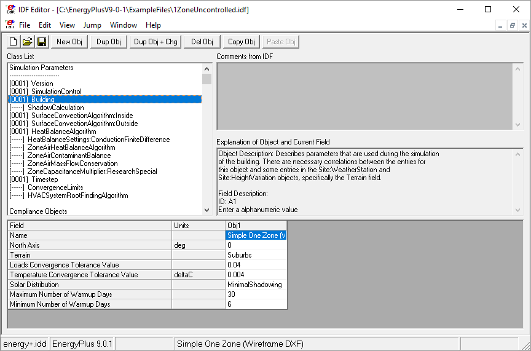

Run-Check-Edit Repeat 
----------------------

For most building energy modeling projects, whether assisting in early
design, refining a design, selecting a control method, or calibrating an
existing building, the use of EnergyPlus will be part of a repeating
process. The process will probably be in the form of:

-  Running an EnergyPlus input file

-  Checking error and other output files

-  Fixing the input file

-  Repeat

Don’t expect that an initial model is ever correct; it is probably not.
Initially, errors are likely to exist. The .ERR file should be the first
file checked each time EnergyPlus is run. The .ERR file has several
levels of messages:

-  Warning

-  Severe

-  Fatal

A Fatal error means that EnergyPlus has stopped during the simulation
and the input file needs to be fixed before the simulation can be run to
completion. Fatal errors should be the first thing fixed. Some Fatal
messages reference previous Severe messages so in that case those should
be fixed. Since the entire simulation was not performed, it is likely
that once the fatal errors are fixed that new Severe and Warning
messages will be shown. After all Fatal messages are eliminated, you
should work on Severe messages; they should also be fixed. Finally,
Warning messages should be reviewed. Often Warning messages are
informative and point out unusual configurations, conditions, or
choices. If what is being described by the Warning message is as
intended, then the Warning message can be ignored. More often, the
Warning message points out something that is not as intended and should
be fixed or addressed. Since the .ERR file is a text file; you can
usually keep it open in a text editor program. Many (but not all) text
editor programs will detect that the .ERR file has been updated after
each EnergyPlus simulation and lets you load the most recent version.

The next files to be examined are ones that show output results from the
simulation. Either the tabular output file (usually an HTML file see
Output:Table:SummaryReports and OutputControl:Table:Style) or CSV file
(see Output:Variable and Output:Meter) should be examined depending on
what you want to look at. Upon examination of the output results, it is
very likely that an aspect of the building and its systems are not
behaving as expected. For example, the Annual Building Utility
Performance Summary report contains a subtable titled Comfort and
Setpoint Not Met Summary. If an annual simulation has 100s or 1000s of
hours of setpoint not met, then the HVAC system is undersized, or the
controls are not working as expected. With an input file representing
many thousands of assumptions, some assumptions made by you or as a
default of EnergyPlus are likely to be incorrect. Revising the
EnergyPlus input file to address this may cause new issues to be shown
in the .ERR file so it should *always* be examined after each change.

To speed the process of running the simulations, you may want only to
run a design day (see SimulationControl and SizingPeriod:DesignDay) or a
subset of the year (see RunPeriod) while developing and debugging the
inputs. This approach speeds up the simulation time itself, and if used,
please remember to recheck the .ERR file when running an annual
simulation for the first time.

Key Concepts
------------

The following sections highlight some key concepts in EnergyPlus

Everything Included
~~~~~~~~~~~~~~~~~~~

One principal that EnergyPlus uses is that (almost) everything is
specified in the input file. This means that instead of referencing an
external library for materials, schedules, equipment performance, etc.,
the input objects that fully describe those items should be included
directly in the input file. In addition, each input object contains a
list of values for every field that needs one. The DataSets folder
distributed with EnergyPlus contains these kinds of details and to use
them, the input objects should be copied into the input file that you
are developing. This approach does make the file include more
specification than you might be used to, and typically results in a
large input file, but you will have the assurance of knowing that all
the inputs related to your building are in the input file you have
developed. There are a few exceptions where external data is referenced
such as with Schedule:File input objects.

Wall Thickness
~~~~~~~~~~~~~~

Exterior and interior walls in real buildings have a thickness as
specified on building plans by detailed cross-sections. For EnergyPlus,
the Construction input object is made up of a list of names for the
Material input objects that make up the wall or roof or floor. Each
material input object has a thickness along with the conductivity,
density, specific heat and other factors. These thicknesses should match
the thicknesses shown in the detailed cross-sections. But when it comes
to specifying the walls themselves in three-dimensional space, the walls
should be entered assuming zero thickness. Once each surface has been
placed, changing the material thickness will have no impact on zone
volume, ceiling height, floor area, shading, or daylighting. For most
modern buildings the choice of where to locate the wall: inside vs.
outside vs. centerline should have little impact on results, so many
modelers just pick one and let the volumes be slightly off. Using
centerlines throughout the model splits the difference. Or some modelers
use outer edges for exterior walls and then use centerlines for interior
walls. If you are modeling a very thick wall, such as an old stone
building, then you also have thermal mass considerations. If you use the
outside edges there will be too much mass, inside will be too little.
Again, centerline will split the difference and will be very close to
the correct amount of thermal mass (possibly losing some corner mass).

Zones Are Not the Same as Rooms
~~~~~~~~~~~~~~~~~~~~~~~~~~~~~~~

A zone, sometimes called a “thermal zone,” is a theoretical construct
that usually describes a group of rooms that can be treated as a single
thermal entity. A zone typically includes multiple rooms. Often a zone
can be seen as a group of rooms that share a single thermostat. In the
case of many similar rooms with the same thermal and operating
characteristics, even if many different thermostats are used, they may
still be grouped into a single zone in EnergyPlus.

One Construction Per Surface
~~~~~~~~~~~~~~~~~~~~~~~~~~~~

Only one type of construction can be associated with each surface so if
the top half of a wall is made up of a different construction than the
bottom half of the wall, the top half and the bottom half each need to
be represented as separate surfaces.

Available Outputs Created by First Simulation
~~~~~~~~~~~~~~~~~~~~~~~~~~~~~~~~~~~~~~~~~~~~~

Since EnergyPlus creates a custom list of possible output variables
during each simulation, you need to perform a simulation first before
you can see them. To create the list use the Output:VariableDictionary
input object and then check the .RDD and .MDD files that are created.
Select the outputs you want and specify them in the input file.

Always Plan Ahead
~~~~~~~~~~~~~~~~~

Some preliminary steps will facilitate the construction of your input
file. EnergyPlus requires some information in specified, externally
available formats; other information may require some lead time to
obtain. The following checklist should be completed before you start to
construct your input file.

-  Obtain location and design climate information for the city in which
   your building is located. If possible, use one of the weather files
   available for your weather period run.

-  Obtain sufficient building construction information to allow
   specification of overall building geometry and surface constructions
   (including exterior walls, interior walls, partitions, floors,
   ceilings, roofs, windows, and doors).

-  Obtain sufficient building use information to allow specification of
   the lighting and other equipment (e.g., electric, gas, etc.) and the
   number of people in each area of the building.

-  Obtain sufficient building thermostatic control information to allow
   specification of the temperature control strategy for each area of
   the building.

-  Obtain sufficient HVAC operation information to allow specification
   and scheduling of the fan systems.

-  Obtain sufficient central plant information to allow specification
   and scheduling of the boilers, chillers and other plant equipment.

-  Obtain utility tariff information when expressing the results as
   costs.

-  Obtain component cost information when performing life-cycle costs.

What Are All These Folders?
---------------------------

The installation of EnergyPlus includes many different files in
different folders:

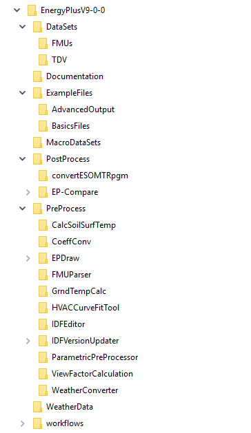

Many of these folders include valuable resources for using and learning
EnergyPlus.

-  The main folder includes the EnergyPlus executable which can be used
   on the command line and EP-Launch 2, a program that makes it easier
   to use EnergyPlus and the Energy+.IDD that describes each possible
   EnergyPlus input object and the default, minimum, maximum, and
   options for each field within each input object.

-  The Documentation folder includes this document as well as the
   InputOutputReference, EngineeringReference, AuxiliaryPrograms,
   OutputDetailsAndExamples which are very important to understand. If
   you haven’t looked through the documentation yet, take a few minutes
   and get familiar with it.

-  The DataSets and MacroDataSets folders include files containing
   libraries of input objects that may be useful in constructing your
   own input files. The ASHRAE_2005_HOF_Materials.idf and
   WindowConstructs.idf files, for example, will help with defining
   walls and windows.

-  The ExampleFiles folder includes a huge number of example files that
   are indexed in the two HTML files in that folder or can be searched
   through using most text editors.

-  The Preprocess and PostProcess folders include many utilities that
   can be used directly or as part of EP-Launch that can aid in the
   setting up input files or extracting or converting results. The
   WeatherData folder includes a small sample of the many weather files
   that are available. For other weather files, please see the previous
   section on `[subsec:Weather-Files] <#subsec:Weather-Files>`__.

What Are All These Output Files?
--------------------------------

When running EnergyPlus using EP-Launch or from the command line,
depending on the options selected, many different output files may be
generated. The file extensions and file suffixes (added to the original
file name prior to the file extension are shown below:

-  ERR – list of errors and warnings

-  TABLE.HTML, TABLE.TXT, TABLE.TAB, TABLE.CSV, TABLE.XML – tabulated
   report of the bin and monthly data in HTML, space delimited, tab
   delimited, comma delimited, or XML format. This is one of the primary
   output files.

-  CSV, TAB, or TXT – time series output from the Output:Variable input
   object in a comma, tab, or space delimited format (generated by the
   ReadVarsESO postprocessor or directly from EnergyPlus using
   OutputControl:Files)

-  METER.CSV, METER.TAB, or METER.CSV File – time series output from the
   Output:Meter input object in a comma, tab, or space delimited format
   (generated by the ReadVarsESO postprocessor or directly from
   EnergyPlus using OutputControl:Files)

-  SQL - sqlite3 output database format

-  EIO – additional EnergyPlus results

-  RDD – list of output variables available from the run

-  MDD – list of output meters available from the run

-  MTD – list of meter component variables

-  DXF – drawing file in AutoCAD DXF format

-  AUDIT – input file echo with input processor errors and warnings

-  BND – HVAC system node and component connection details

-  DBG – output from the debug command

-  EDD – Energy Management System details

-  END - a single line synopsis of the simulation

-  EPMIDF – clean idf file after EP-Macro processing

-  EPMDET – EP-Macro detailed output with errors and warnings

-  ESO – raw Output:Variable output before processing into CSV, TAB, or
   TXT files

-  MTR – raw Output:Meter output before processing into CSV, TAB, or TXT
   files

-  SHD – output related to shading

-  SLN – output from “report, surfaces, lines”

-  SSZ – system sizing details in a comma, tab, or space delimited
   format

-  ZSZ – zone sizing details in a comma, tab, or space delimited format

-  MAP – daylighting illuminance map

-  DFS - daylighting factors report

-  Screen.CSV - window screen transmittance map report

-  RVAUDIT - output from the ReadVarsESO post-processing program

-  SVG - HVAC Diagram related to the arrangement of HVAC components

-  SCI - surface cost information report

-  WRL – drawing file in VRML (Virtual Reality Markup Language) format

-  Delight IN - DElight input generated from EnergyPlus processed input

-  Delight OUT – Detailed DElight output

-  Delight ELDMP – DElight reference point illuminance per time step

-  Delight DFDMP – DElight warning and error messages

-  EXPIDF – Expanded IDF when using HVACTemplate input objects

-  Group Error – combined error files for a group run

-  VCpErr – Transition program error file

-  Proc.CSV – Simple statistics generated from CSVProc

Most of these output files are documented in the Output Files chapter of
the OutputDetailsAndExamples document.

Don’t be intimidated by the long list of files; you can do a lot in
EnergyPlus with just the IDF input file, the TABLE.HTML file, and the
ERR file. The building description, the detecting and solving of errors,
and the most common primary outputs are found between these three files.
Starting with these three files and branching out to others as needed is
a good strategy for using EnergyPlus.

Versions and Updating
---------------------

EnergyPlus version updates are released generally twice per year in
March and September. Each version of EnergyPlus is installed to a unique
folder, so it is possible, and recommended, to keep older versions in
place when adding a new one. This is very helpful if you need to go back
and make a change to an older project and don’t want to introduce
version-related changes in results. When using the IDF input file format
with EnergyPlus, each release is likely to have small changes to the
file format. Included with EnergyPlus are a number of ways to update
files so that they are compatible with the release. Each method
ultimately uses the TransitionVx-x-x-ToVx-x-x.exe files that are located
in the Preprocess\\IDFVersionUpdater folder. The ways to update your IDF
files are:

-  IDFVersionUpdater program (shown below) is included in the
   installation and works on multiple platforms. It is located in the
   Preprocess\\IDFVersionUpdater folder. It can convert from EnergyPlus
   7.2 to the most recent version, and even older versions can be
   converted if the proper files are requested from the
   `helpdesk <https://energyplushelp.freshdesk.com/>`__. It can also
   update a group of files. It is documented in the Chapter titled
   “Using Older Version Input Files - Transition” in the
   AuxiliaryPrograms document.

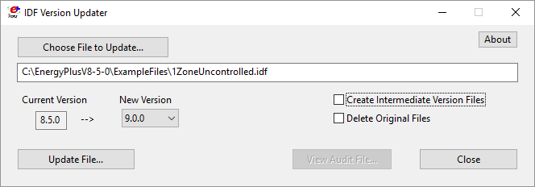

-  EP-Launch 2 - The Windows-only program that comes with the EnergyPlus
   installation can update a single file from the just previous version
   of EnergyPlus by using the File...Transition command.

-  EP-Launch 3 - The program for Windows, Linux, and MacOS can update a
   single file across multiple versions using the Transition workflow.

-  Command line Transition - This allows updating files using the
   command line such as the Terminal for MacOS and Linux or the CMD or
   PowerShell for Windows. It is documented in the Chapter titled “Using
   Older Version Input Files - Transition” in the AuxiliaryPrograms
   document.

Errors and How to Fix Them
--------------------------

As described in the section dealing with errors described in the ERR
file are part of creating files with EnergyPlus. Resolving errors is
something that both new and very experienced users have to do. Most of
the error message itself, if carefully reviewed will point to the
problem. Some error messages will also reference earlier messages that
should also be checked. A careful review of the ERR file and the input
file will often reveal solutions to the most common errors. Also, see
the section.

Data Sets
---------

EnergyPlus uses snippets of IDF files to create the library of data that
may be useful for you. Two folders are created upon installation:
DataSets – which contains IDF snippets and MacroDataSets – which also
contain IDF snippets but are in a form such that they can be easily used
with the EPMacro program. Another data set are DDY files that accompany
each EPW weather file. The DDY files include several varieties of the
corresponding design day data for each weather file location.

Other Useful Utility Programs
-----------------------------

The EnergyPlus install includes a variety of tools to help with various
aspects of converting data or displaying information to help with using
EnergyPlus

-  Coefficient Curve Generation - The CoeffConv and CoeffConv utility
   programs can be used to convert DOE-2 temperature dependent curves
   (Fahrenheit) to EnergyPlus temperature curves (Celsius). These
   programs are described in the Auxiliary Programs document.

-  HVAC Performance Curve Fit Tool - The CurveFitTool.xlsm spreadsheet
   generates performance curves for a set of tabular data as typically
   supply by manufacturers

-  HVAC-Diagram - Another post-processing program is the HVAC-Diagram
   application. It reads one of the EnergyPlus output files
   (eplusout.bnd) and produces a Scalable Vector Graphics (SVG) file.
   Many web browsers and other drawing programs can open SVG files. This
   utility runs automatically with EP-Launch. More information on the
   HVAC Diagram program is found in the Auxiliary Programs document.

-  convertESOMTR - This simple post-processing program can be used
   seamlessly with EP-Launch to provide IP (inch-pound) unit output
   files rather than SI units. This program is described more fully in
   the Auxiliary Programs document.

-  WeatherConverter - Used to convert epw to csv format with column
   headings to inspection of the data.

Input Object Groups
===================

The following sections provide an overview of the input objects based on
groups described in the energy+.idd file and the InputOutputReference.
The sections give you a taste of the capabilities and may help guide you
to further investigation on how to model your building or a specific
energy efficiency measure.

Simulation Parameters
---------------------

EnergyPlus includes a group of input objects used to set general
parameters related to how the simulation is performed. Some of these
input objects are controlling different options that are allowed within
EnergyPlus such as the selection of algorithms to use or parameters
related to how an algorithm is used. For a new modeler, these input
objects should be included with their default field values. Later when
additional control is necessary to model a specific type of measure, the
field values can be re-evaluated. The following input object allows you
to control how you want the simulation to be performed. The input
objects should appear in your file and appear in almost all of the
example files:

-  SimulationControl - controls if the simulation is run for the weather
   file period and if sizing calculations are performed. You should
   become familiar with this input object since you may find it one that
   you frequently change during the Run-Check-Edit cycle.

Two other input objects should appear in your input file and are
included in almost all example files:

-  Version - indicates what version of EnergyPlus is being used.

-  Building - includes fields for the name of the building, and the
   angle of the entire building compared to true north, as well as
   parameters related to the simulation that, in general, should be
   allowed to default.

For a new modeler, the following input objects may be omitted. They can
be added later for special cases although they appear in almost all of
the example files:

-  Timestep - the number of timesteps each hour and usually set to 6.

-  HeatBalanceAlgorithm - selects the algorithm used for simulating heat
   and moisture transfer through the surfaces of the building and
   usually set to ConductionTransferFunction.

-  SurfaceConvectionAlgorithm:Inside - selects the algorithm used for
   the inside face of the building surfaces and is usually set to TARP.

-  SurfaceConvectionAlgorithm:Outside - selects the algorithm used for
   the outside face of the building surfaces between interior and
   exterior conditions and is usually set to DOE-2.

These input objects and more are further explained in the
InputOutputReference under the heading “Group-Simulation Parameters.”

Location and Climate
--------------------

Many of the fields in the group of input objects related to location,
climate, and the weather file are ones that will be set once for each
specific project.

-  Site:Location - describes the name, latitude, longitude and other
   parameters related to the location of the building. When using a
   weather file, the values from the weather file will be used instead.
   Predefined location objects may be found in the DDY file that
   accompanies most epw weather files.

-  SizingPeriod:DesignDay - the high and low temperature and humidities
   describing a design day that is used for sizing equipment. Two (or
   more) instances of this input object are frequently in a file, one
   for heating and one for cooling. The DDY file that comes with the
   weather file should include input objects that may be used here.

-  RunPeriod - the start and stop dates of the simulation and often set
   to the full year. When debugging a file, a shorter period of time can
   be used to speed up the simulation portion of the Run-Check-Edit
   cycle.

-  RunPeriodControl:SpecialDays - allows specification of holidays and a
   good example can be seen in 5ZoneCostEst.idf.

-  RunPeriodControl:DaylightSavingTime - allows the specification of the
   start and ending period for daylight savings time. This will impact
   when schedules operate but please note that output reporting
   timesteps are always shown in standard time so schedules will shift
   an hour in the output when daylight savings time is active. A good
   example can be seen in 5ZoneCostEst.idf.

-  Site:GroundTemperature:BuildingSurface - for one of the ground
   temperature algorithms, specifies the average temperature for each
   month of the year. This temperature is applied directly to the
   outside face of surfaces which use the Ground outside boundary
   conditions. See Ground Heat Transfer in EnergyPlus in the Auxiliary
   Programs document for information about preprocessors. There are also
   other more integrated ground heat transfer options, see
   Site:GroundDomain:\* and Foundation:Kiva.

-  Site:WaterMainsTemperature - input for the water temperatures
   supplied to the building from underground water mains and should be
   specified whenever water heaters are described. A good example can be
   seen in 5ZoneVAV-ChilledWaterStorage-Mixed.idf. If not specified,
   some default assumptions are used for the water temperature supplied
   to the building.

Other input objects in this group can help perform sizing using the
weather file, override the sky temperature, impact the variation of
outdoor conditions with building height (especially important for tall
buildings), work with ground temperatures and ground heat transfer,
override the precipitation in weather files, specify the irrigation for
a green roof, and some advanced properties related to the light spectrum
for window performance. These input objects and more are further
explained in the InputOutputReference under the heading “Group-Location
and Climate.”

Schedules
---------

Many aspects of building operation are characterized by timing whether
it is the hours that a building is occupied or when the control systems
are in various modes. Due to this, specifying when something occurs
using the Schedule input objects becomes one of the most common things
to do. It is important to coordinate schedules properly. The operation
of office equipment in a space usually corresponds to occupancy of that
space as does the thermostat set points and fan operation. Because
schedules are such a key input for so many features of a building, a
great deal of flexibility exists in EnergyPlus to specify them.

-  Schedule:Compact - The most commonly used method of specifying
   schedules and uses “Through” and “For” to reduce the amount of input
   required.

-  ScheduleTypeLimits - Every schedule input object includes a field
   that helps validate the limiting values for the schedule, and this
   input object describes the upper and lower limit.

-  Schedule:Constant - If the value of the schedule is the same every
   hour of the year, this input object is the easiest way to specify
   that value.

-  Schedule:File - At times, data is available from a building being
   monitored or for factors that change throughout the year. This input
   object allows a column of data from an external file to be referenced
   as the values of the schedule. A variation of this input object
   allows input specifically for shading.

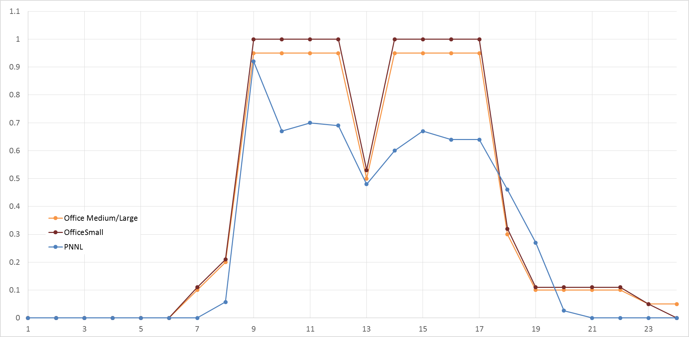

Other input objects in this input group allow specification of schedule
values to be in different formats. These input objects and more are
further explained in the InputOutputReference under the heading
“Group-Schedules.”

Surface Construction Elements
-----------------------------

Specifying the physical properties of the building envelope is something
every building model includes. The input objects in this group allow the
specification of the different layers that make up exterior and interior
walls, roofs, floors, windows, and skylights as well as the order of the
materials in these surfaces. A large number of input objects appear in
this group since there are many special features that need to be modeled
for certain energy efficiency measures. The following is a list of only
the most commonly used input objects.

-  Material - the most common input object to describe the materials
   used in opaque constructions in walls, roofs, and floors and includes
   inputs for the thickness, conductivity, density, and specific heat as
   well as absorptances. See examples in ASHRAE_2005_HOF_Materials.idf
   located in the DataSets folder.

-  Material:NoMass - used when the material only has thermal resistance
   and little thermal mass such as insulation. It should not be used to
   describe materials that do have significant thermal mass.

-  Material:AirGap - used to describe when walls or roofs have an air
   gap. Note, this is modeled as a fixed resistance (with no internal
   convection or radiant transfer), and it cannot be used for windows.

-  WindowMaterial:Glazing - describes the material used in the glass (or
   other transparent material) portion of the fenestration (windows and
   skylights). See WindowGlassMaterials.idf in the DataSets folder for
   examples.

-  WindowMaterial:Gas - the type of gas used between layers of glass in
   windows and skylights has a significant impact on the heat transfer
   performance. See WindowGasMaterials.idf in the DataSets folder for
   examples.

-  Construction - a list of materials (any from the list above plus
   others) in order from the outside to the inside making up the wall,
   roof, floor, window or skylight. Every input file will have several
   of these input objects. Examples of constructions for walls, roofs,
   and floors can be found in ASHRAE_2005_HOF_Materials.idf located in
   the DataSets folder while examples for windows and skylights can be
   found in WindowConstructs.idf in the same folder.

-  WindowMaterial:SimpleGlazingSystem - the best way to describe a
   window is with a construction input object that references
   WindowMaterial:Glazing and WindowMaterial:Gas input objects but if
   all you have is the U-Factor and Solar Heat Gain Coefficient (SHGC)
   they can be specified in this input object.

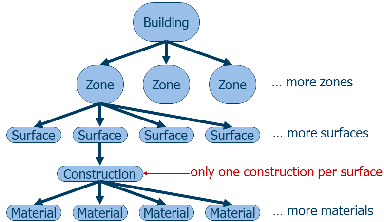

A large variety of input objects in this group are not as commonly used
but are key to modeling specific types of walls and windows so if what
you are trying to model does not fall into the neat categories for the
input objects described so far, there is still a good chance that
EnergyPlus has an input object that will work. These other input objects
include ones for walls and roof that can be used when modeling combined
heat and moisture transfer, modeling materials which undergo a phase
change to store heat in the wall or when the material properties change
with temperature, when the material allows infrared radiation to flow
through it, when modeling green (vegetated) roofs, for simplified C- or
F-factor modeling, or when the wall includes resistance or hydronic
tubing to provide heat. The other input objects to describe windows and
skylights include input objects that can be used to describe
thermochromic and electrochromic glazing, mixtures of gases between
layers of glass, vacuum glazing, movable portions of the window assembly
such as shades and blinds and screens, alternative ways of specifying
fenestration such as equivalent layers or refraction extinction method
or ASHWAT model or from a WINDOW program export/data file or specifying
wavelength-by-wavelength properties.

The input objects described in this section are further explained in the
InputOutputReference under the heading “Group-Surface Construction
Elements.”

Thermal Zones and Surfaces
--------------------------

The physical aspects of the building such as the walls, roof, and
windows, is one of the most important and often challenging aspects of
creating a building energy model. In EnergyPlus, the surfaces define the
geometry of each zone and thus for the entire building. For many, a
graphical user interface will be used to help define the geometric
aspects of the building energy model, and many of the input objects
described in this section will be directly created by that interface
program. It is still important to understand some of the details for
these input objects because it is likely that you will be reviewing them
as part of debugging error messages. EnergyPlus uses the three
dimensional position of each corner of a surface to define the position
and orientation of that surface so for a typical rectangular wall that
represents 12 numbers and for a typical building with hundreds of
surfaces that means thousands of numbers are used to define the geometry
of a building so you can see why using an interface is so common.

EnergyPlus uses a right-hand coordinate system as shown in Figure X with
three dimensions. The X-axis points east, the Y-axis points north, and
the Z-axis points up.

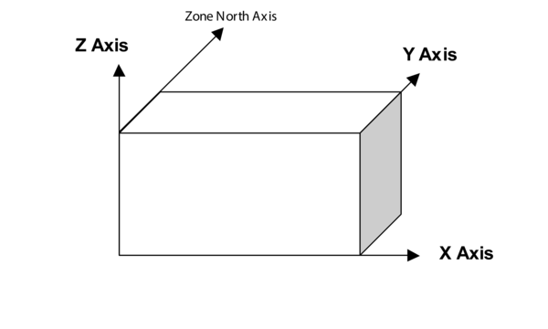

-  Zone - defines the name of the thermal zone as well as the ceiling
   height, floor area, and volume. For most zones that are fully
   enclosed these three entries can be calculated automatically be
   EnergyPlus and do not need to be entered. A zone multiplier allows a
   single zone to represent many identical zones (such as all the
   enclosed offices on one side of a building). The name of the zone
   will be referenced in many places in the input file so it should be
   clear what it is describing. When defining a zone, it is important
   for the entire area to be thermally similar both in heat being
   transferred through exterior walls as well as interior heat gains.
   But using as few zones as possible (and thus as few surfaces) also
   can result in faster simulations, so there is no reason to slow down
   the simulation just so two (or more) essentially identical areas are
   each simulated. The coordinates can be just set to zero if the world
   coordinate system is used (see GlobalGeometryRules below).

-  BuildingSurface:Detailed - lists the three-dimensional coordinates
   that define each corner as well as referencing the zone that the
   surface is attached to and the construction of the wall (list of
   materials). This input object supports any shape surface with three
   or more corners (vertices). In addition, this input object defines
   what is on the other side of the surface from the zone, whether that
   is outside, another zone in the building, or the ground. Other inputs
   indicate if the outside of the surface is exposed to the sun or the
   wind.

-  FenestrationSurface:Detailed - describes windows, doors, and special
   daylighting tubes and it references the wall that it is part of. It
   also requires the specification of vertices (usually four but three
   is also allowed) to describe the corners of the window or door as
   well as the construction which, in this case, is generally the layers
   of glass and the gas fill between the layers. It has a field for a
   multiplier although usually the multiplier is set to one since the
   position of windows matters to many of the algorithms used. In order
   to describe the frame of the window and any dividers that it might
   have, a separate input object (WindowProperty:FrameAndDivider) may be
   included and referenced. A good example file is WindowsTests.idf. To
   understand how to model the many options for windows, a section and a
   table in the Input Output Reference called “Window Modeling Options”
   should be examined.

Shading Related
~~~~~~~~~~~~~~~

Casting shadows on the building, especially onto windows, can
significantly impact the energy use of a building, and EnergyPlus
includes several input objects to model this effect. The largest impact
of shading surfaces is to reduce solar gain through windows that are
shaded. There are two kinds of shading surfaces in EnergyPlus, detached
and attached. A detached shading surface, such as a tree or neighboring
building, is not connected to the building. An attached shading surface
is typically an overhang or fin that is attached to a particular base
surface of the building, usually a wall; attached shading surfaces are
usually designed to shade specific windows.

-  Shading:Site:Detailed - describes something near but not attached to
   the building that casts a shadow on the building such as nearby
   buildings or mountains and includes the vertex of one corner as well
   as the length and width. For deciduous trees, and other situations
   that shading changes over time, the schedule for the transmittance
   can vary, otherwise, it should always be set to zero or leave the
   schedule name blank.

-  Shading:Zone:Detailed - describes an attachment to the building that
   casts a shadow such as an overhang or fin. It also includes a
   reference to a transmittance schedule. The wall that the fin or
   overhang is attached to is also specified.

If using relative coordinates (see GlobalGeometryRules), you may also
want to use the Shading:Building:Detailed input object since it will
“rotate” with the building. Typically, Shading:Site:Detailed is used for
things that are fixed at the site and don’t move with building rotation.
Shading:Building:Detailed is for larger structures like a parking garage
or canopy which aren’t associated with a specific zone but would likely
rotate with the building.

Input Object Variations
~~~~~~~~~~~~~~~~~~~~~~~

EnergyPlus includes a bunch of variations on these basic surface input
objects that map to a closer representation of real surfaces in
buildings. These input objects are effectively just different ways to
represent the same information as the BuildingSurface:Detailed,
FenestrationSurface:Detailed, and Shading:Zone:Detailed input objects.
These input objects are seldom created by graphical user interfaces, so
it is unlikely that you will see them. Some of these input objects also
have simpler methods for specifying geometry, such as using a single
vertex, height, width, tilt, and azimuth or just specifying the fin
location relative to the window edge. The following is a list of these
input object variations for surfaces:

-  Wall:Detailed, Wall:Exterior, Wall:Adiabatic, Wall:Underground,
   Wall:Interzone

-  RoofCeiling:Detailed, Roof

-  Floor:Detailed, Floor:GroundContact, Floor:Adiabatic, Floor:Interzone

-  Ceiling:Adiabatic, Ceiling:Interzone

-  Window, Window:Interzone

-  Door, GlazedDoor, Door:Interzone, GlazedDoor:Interzone

-  Shading:Site, Shading:Building, Shading:Overhang,
   Shading:Overhang:Projection, Shading:Fin, Shading:Fin:Projection

Other Related Input Objects
~~~~~~~~~~~~~~~~~~~~~~~~~~~

-  GlobalGeometryRules - A required input object that should be in all
   files. It sets the way geometry is specified for all of the surface
   input objects. The most common approach is that the order of
   coordinates for each surface should start with the upper left corner
   (when viewed from “outside” the zone with the surface) and that the
   coordinates should proceed in a counter-clockwise order. In addition,
   most common is to use a world coordinate system where all the
   vertices are based on a single coordinate system for the entire
   building rather than one that changes relative to each zone. However,
   if you want to rotate the building, then you must specify Relative
   coordinates, and the zone origins may all remain at (0,0,0).

-  WindowShadingControl - for a window, describes the kind of movable
   shading (interior shade, interior blind, between glass shade,
   exterior blind, etc..) as well as how it is controlled and the
   physical material of the shade or window construction with the shade.
   Good examples are in the PurchAirWithDaylightingAndShadeControl.idf
   file.

-  WindowProperty:FrameAndDivider - defines the frame material around a
   window and any dividers between separate lites of the window (see
   Figure X). While a window does not necessarily need to define the
   frame, it is a more accurate approach since the heat transfer through
   the frame usually has significant impacts the overall performance of
   a window. Note that the area of the Fenestration:Detailed object is
   the glazed area without the frame. The frame extends beyond the
   glazed area. See the PurchAirWithDaylighting.idf example file.

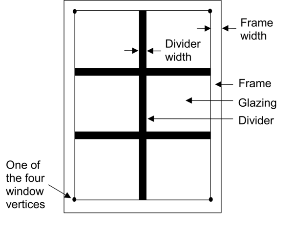

-  WindowProperty:AirflowControl - defines windows that have forced air
   flow between the panes of glass, also called heat-extract windows or
   climate windows. See the example file
   AirflowWindowsAndBetweenGlassBlinds.idf.

-  WindowProperty:StormWindow - allows the definition of a movable storm
   window that is usually applied to a window in the winter. See the
   StormWindow.idf example file.

-  InternalMass - used to define thermal mass that is not described
   anywhere else in the model - often used to capture the effect of
   furnishings or interior floors that are not being modeled. Used in
   many example files including RefBldgLargeOfficeNew2004_Chicago.idf.

-  ShadingProperty:Reflectance - specifying the reflectance properties
   for shading and is only needed if the input object Building specifies
   the “with reflections” option. See the ReflectiveAdjacentBuilding.idf
   example file.

Other less common input objects include ZoneList and ZoneGroup that can
be used when doing multi-story simulations and GeometryTransform which
allows a building model to be stretched with just a few inputs.

Internal Gains 
---------------

Inside a building, people, appliances, office equipment, lighting, and
other devices produce heat. The combination of all these items that
produce heat within a building are called internal gains and represents
a significant contribution, sometimes the largest contribution, to the
cooling requirements for a building. In addition, they offset the amount
of heat from the HVAC system that is needed at a given time. Typically,
the peak value is entered in the input objects for this group such as
the maximum number of people, the total power of equipment, or the total
lighting power and then a schedule is used to modify that value each
hour of the year. It is just as critical that the schedule values are
realistic for your building as is the peak value. For almost all
buildings, it is rare that the peak occupancy occurs for more than a few
hours per year if at all and this is especially the case for retail
stores, theaters, and sports complexes. Even office buildings when
counting vacations and people out of the building for meetings will
rarely have peak occupancy.

The most common internal gain input objects that are shown in almost all
the example files are:

-  People – specifies not only the sensible, latent and radiant heat
   from people but also includes ways of reporting the comfort of
   occupants using a variety of thermal comfort models. The
   DynamicClothing.idf example file shows how to use the thermal comfort
   models.

-  Lights – describes the heat related to lighting systems.

-  ElectricEquipment – describes the heat related to electrical
   appliances, office equipment, and other heat sources that are powered
   by electricity.

-  GasEquipment - specifies the heat related to cooking appliances and
   other equipment that uses natural gas.

Less common internal gains input objects include:

-  OtherEquipment - describes any heat gain or loss (sensible, radiant,
   and/or latent) that impacts the space but does not consume utility
   energy in the simulation. Typically used to model a process load
   which is not to be included in the overall building energy
   consumption.

-  ElectricEquipment:ITE:AirCooled - see the
   1ZoneDataCenterCRAC_wApproachTemp.idf example file.

-  SwimmingPool:Indoor - see the 5ZoneSwimmingPool.idf example file.

Other

-  ComfortViewFactorAngles – allows the specification of how different
   surfaces impact the thermal comfort calculations for the occupants.
   See the PurchAirWithDaylightingAngleFac.idf example file.

The Internal Gains group also contains input objects related to zone
contaminant sources and sinks. The input objects include modeling
components that impact contaminant concentrations which are scheduled,
pressure driven, use a cut off model, assume a decaying source, surface
diffusion, or using a deposition velocity model. The input objects
described in this section are further explained in the
InputOutputReference under the heading “Group-Internal Gains.”

Daylighting 
------------

Reducing the amount of powered lighting that is used when sufficient
natural daylight illuminates the interior building through windows and
skylights is called daylighting. Automatics daylighting control systems
are a very common energy efficiency measure in buildings and are often
required for new building designs depending on the energy code that
applies to the building location. The most common input objects related
to daylighting are:

-  Daylighting:Controls – specifies the algorithm used for daylighting,
   the dimming of lights is continuous or stepped, and how glare
   calculations are performed.

-  Daylighting:ReferencePoint – specifies the location of the sensors
   for the daylighting control system.

The InputOutputReference includes not only a description of these input
objects but also extra guidance on how they should be applied. The
PurchAirWithDaylighting.idf contains examples of these input objects.

Three different devices can be used with daylighting:

-  DaylightingDevice:Tubular - see the DaylightingDeviceTubular.idf
   example file.

-  DaylightingDevice:Shelf - see the DaylightingDeviceShelf.idf example
   file.

-  DaylightingDevice:LightWell - see the GeometryTest.idf example file.

An input object called Daylighting:DELight:ComplexFenestration is used
with one of the two control methods specified in the
Daylighting:Controls input object when used in conjunction with complex
fenestration systems such as prismatic and holographic glass.

Some flexibility is given to provide extra output related to daylighting
and includes:

-  Output:DaylightFactors – creates a special report on the factors used
   in daylighting. See the ReportDaylightFactors.idf example file.

-  Output:IlluminanceMap – allows the generation of maps of illuminance
   values within each interior zone that uses daylighting controls. The
   exact file format can be set using the
   OutputControl:IlluminanceMap:Style input object. See the
   DaylightingDeviceTubular.idf for example of both input objects.

More details of these output options can be found in the
OutputDetailsAndExamples document. The input objects described in this
section are further explained in the InputOutputReference under the
heading “Group-Daylighting.”

Advanced Construction, Surface, Zone Concepts
---------------------------------------------

The group of input objects contains many special cases for more
sophisticated modeling for constructions, surfaces, and zones. As part
of this, one of the ways to model building foundations called Kiva is
described. See the ZoneCoupledKivaBasement.idf and
ZoneCoupledKivaSlab.idf example files for example of these input
objects.

-  Foundation:Kiva - describes the insulation depth and width for
   interior and exterior horizontal and vertical insulated foundations
   as well as the construction for the wall footing, see Figure X .

-  Foundation:Kiva:Settings - sets the soil conditions and other
   parameters related to the Foundation:Kiva input object.

-  SurfaceProperty:ExposedFoundationPerimeter - used to set the portion
   of the foundation that is along the exterior perimeter of the
   building that undergoes heat transfer with the environment. Edges of
   underground surfaces that are fully under the building and not along
   the perimeter are not expected to have any heat transfer with the
   environment.

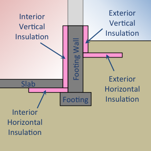

Input objects of interest in this group not related to Kiva include

-  SurfaceControl:MovableInsulation - allows the modeling of insulation
   panels that are removable for walls, floors, and roofs but not
   windows. See MovableExtInsulationSimple.idf and
   MovableIntInsulationLightsLowE.idf example files.

-  SurfaceProperty:Underwater - allows the outside of the building to be
   modeled as underwater and even as moving through the water allowing
   EnergyPlus to model vessels. See the
   VaryingLocationAndOrientation.idf example file.

-  SurfaceProperty:ExteriorNaturalVentedCavity - provides a method to
   include the modeling of baffles in the multi-skin exteriors. See the
   HP_wICSSolarCollector.idf example file.

Other input objects in this group set the heat transfer algorithms for
specific surfaces to override the building level heat transfer
algorithm, when other models are used to describe the variation in
temperature on the outside of a surface, override the algorithm used for
modeling convection heat transfer between the air inside or outside of a
zone and the surface, vapor transfer coefficients when using algorithms
that include moisture modeling of surfaces, override the algorithm that
distributes the solar radiation on interior surfaces, overrides the
solar energy absorbed by different layers for complex windows, a way to
override the longwave radiation with other surfaces in the zone, allows
overriding the external environment for a surface or a zone including
solar shading or airspeed or temperature or humidity, overrides the
source term for the heat balance, or overrides the view factors for a
zone. The input objects described in this section are further explained
in the InputOutputReference under the heading “Group-Advanced Surface
Concepts.”

Exterior Equipment
------------------

While equipment that is outside of a building does not impact the
thermal performance of the building, the accounting of all end-uses
including those outside of the building is important for many compliance
and incentive programs that require building energy modeling. See the
ExteriorLightsAndEq.idf example file for these input objects.

-  Exterior:Lights - describes the external site lighting for the
   building grounds, entrances, and facades which are either controlled
   by a schedule or when the sun is set.

-  Exterior:FuelEquipment - describes other energy consumption on the
   site that is external to the building other than lighting.

-  Exterior:WaterEquipment - describes the flow rate of water use on the
   building site outside of the building.

The input objects described in this section are further explained in the
InputOutputReference under the heading “Group-Exterior Energy Use
Equipment.”

Zone Airflow
------------

The Zone Airflow input object group provides a way to model the airflow
between zones and airflow due to natural ventilation (e.g., open
windows) or mechanically-induced ventilation (e.g., exhaust air fans).

-  ZoneInfiltration:DesignFlowRate - provides a way to describe the air
   infiltration into a building through leaks in the envelope including
   around windows or the normal operation of doors. The leakage can be a
   function of temperature and wind speed and can be expressed as either
   a total flow rate, a flow rate per floor area, per wall area, or as
   an air change rate. This input object appears in most example files.

-  ZoneInfiltration:EffectiveLeakageArea - similar to the previous input
   object but uses a different equation to express the infiltration
   rate. The DirectIndirectEvapCoolers.idf file contains an example.

-  ZoneInfiltration:FlowCoefficient - also similar to the
   ZoneInfiltration:DesignFlowRate input object but uses yet a different
   equation.The DirectIndirectEvapCoolers.idf file contains an example.

-  ZoneVentilation:DesignFlowRate - a method to add outside air to a
   zone with similar inputs to the ZoneInfiltration:DesignFlowRate but
   this would represent a purposeful introduction of outdoor air into
   the space. See the 5ZoneNightVent2.idf example file.

-  ZoneVentilation:WindandStackOpenArea - describes the natural
   ventilation driven introduction of outdoor air into the zone using a
   simpler method than an AirflowNetwork model. The inputs include the
   opening area and effectiveness as well as simple controls based on
   zone or outdoor temperature or the difference between the two or wind
   speed. See the VentilationSimpleTest.idf file.

-  ZoneMixing, ZoneCrossMixing, and ZoneRefrigerationDoorMixing - these
   three input objects provide simplified treatments of air exchange
   between zones.

-  ZoneEarthtube - provides a way to model an earth tube which is a way
   to draw outdoor into the zone through an underground pipe in order to
   cool the air in the summer and heat it in the winter. An example of
   this input object is in the EarthTubeSimpleTest.idf file.

-  ZoneCoolTower:Shower - models a passive downdraught evaporative
   cooling tower (sometimes also called a shower cooling tower or a wind
   tower) using natural ventilation and water evaporation to providing
   cooling in typically arid climates. See the
   CooltowerSimpleTestwithVentilation.idf for an example of this input
   object.

-  ZoneThermalChimney - models a passive solar driven thermal chimney
   that utilize the buoyancy of air heated by the sun to provide
   ventilation. See the file ThermalChimneyTest.idf.

-  ZoneAirBalance:OutdoorAir - calculates the combined outdoor airflow
   including the interactions between mechanical ventilation,
   infiltration, and duct leakage and is usually applied to residential
   buildings. See the SingleFamilyHouse_TwoSpeed_ZoneAirBalance.idf file
   for example.

The input objects described in this section are further explained in the
InputOutputReference under the heading “Group-Airflow.”

HVAC Templates
--------------

New users to EnergyPlus need to learn many things to understand how to
create detailed input objects for modeling an HVAC system. In order to
reduce this initial effort, HVACTemplates were created. Unlike other
input objects, the HVACTemplate input objects are not directly processed
by EnergyPlus; instead, a preprocessor called ExpandObjects turns these
HVACTemplate input objects into the detailed HVAC input objects. This
can be used as a learning tool since you can review the .expidf file
that contains the detailed input objects or it can be used for long term
modeling especially if your focus is not on HVAC related energy
efficiency measures. The primary disadvantage of using the HVACTemplate
input objects is that only a small subset of possible configurations can
be modeled using them; however, the subset of configurations supported
by the HVACTemplate input objects was carefully chosen to be some of the
most common HVAC configurations. If the HVACTemplate input objects do
not support the HVAC configuration you are considering; you need to
model it with the detailed HVAC EnergyPlus input objects. When using
HVACTemplate input objects, no regular EnergyPlus input objects related
to HVAC should be used (see the InputOutputReference for some exceptions
to this). The HVACTemplates can model:

-  Baseboard heating systems with optional hot water boiler

-  Fan coil systems with boilers and chillers

-  Packaged terminal air conditioner (PTAC) system with optional hot
   water boiler

-  Packaged terminal air-to-air heat pump (PTHP) systems

-  Water to air heat pumps with boiler and cooling tower

-  Variable refrigerant flow heat pumps (air-to-air)

-  Variable refrigerant flow heat pumps (water-to-air) with boiler and
   cooling tower

-  Direct-expansion (DX) cooling, package and split systems

-  Direct-expansion (DX) heat pump systems

-  Packaged variable air volume system using direct-expansion cooling

-  Variable air volume systems with boilers and air-cooled chillers

-  Variable air volume systems with boilers and water-cooled chillers

-  Constant air volume systems with boilers and water-cooled chillers

-  Dual-duct systems (constant or variable air volume) with boilers and
   water-cooled chillers

-  Dedicated outdoor air systems (DOAS) combined with zonal template
   systems

The Input Output Reference includes a list of exactly which input
objects are needed for each of these configurations

-  HVACTemplate:Thermostat - describes the heating and cooling setpoints
   for a thermostat. This input object can be referenced by multiple
   HVACTemplate:Zone input objects if all the zones have the same
   setpoints.

-  HVACTemplate:Zone:IdealLoadsAirSystem - provides an idealized system
   that supplies air to the zone that meets all loads and uses no
   energy. Best used for load calculations.

-  HVACTemplate:Zone:BaseboardHeat - allows the simulation of electric
   or hot water thermostatically controlled baseboard heaters.

-  HVACTemplate:Zone:FanCoil - describes a four-pipe fan coil system
   with outdoor air intake.

-  HVACTemplate:Zone:PTAC - models a packaged terminal air conditioner
   with either electric, gas or hot water heating coil most commonly
   used in residential or hotel applications.

-  HVACTemplate:Zone:PTHP - models a packaged terminal heat pump system
   most commonly used in residential or hotel applications with either
   electric or gas supplementary heater.

-  HVACTemplate:Zone:WaterToAirHeatPump - describes the distributed
   “terminal” portions of a system which uses a medium temperature loop
   and heat pumps to provide heating and cooling to the building (also
   see HVACTemplate:Plant:MixedWaterLoop).

-  HVACTemplate:Zone:VRF - provides input for variable refrigerant flow
   terminal units.

-  HVACTemplate:Zone:Unitary - describes a constant volume
   direct-expansion system such as a rooftop system or split system.
   Often paired with a single HVACTemplate:System:Unitary for a single
   zone system but can also be part of a multizone system.

-  HVACTemplate:Zone:VAV - simulates the terminal of a variable air
   volume system with reheat.

-  HVACTemplate:Zone:VAV:FanPowered - simulates either a parallel or
   series fan power terminal of a variable air volume system.

-  HVACTemplate:Zone:VAV:HeatAndCool - simulates the terminal of a
   variable air volume system.

-  HVACTemplate:Zone:ConstantVolume - simulates the terminal of a
   constant air volume system.

-  HVACTemplate:Zone:DualDuct - simulates the zone portion of a constant
   volume or variable volume dual-duct HVAC system.

-  HVACTemplate:System:VRF - simulates the variable refrigerant flow
   system.

-  HVACTemplate:System:Unitary - describes the system portion of a
   rooftop or split DX cooling system with electric, gas or hot water
   heating.

-  HVACTemplate:System:UnitaryHeatPump:AirToAir - details the system
   portion of a rooftop or split DX air-to-air heat pump system.

-  HVACTemplate:System:UnitarySystem - models the system portion of a
   rooftop or split system and has more flexibility than the previous
   two input objects.

-  HVACTemplate:System:VAV - simulates the system portion of a variable
   air volume HVAC configuration with chilled water cooling and several
   different heating options.

-  HVACTemplate:System:PackagedVAV - describes the system portion of a
   packaged direct-expansion (DX) based variable air volume HVAC
   configuration with several different heating options.

-  HVACTemplate:System:ConstantVolume - provides input for the system
   portion of a constant air volume HVAC configuration with optional
   chilled water cooling and several different heating options.

-  HVACTemplate:System:DualDuct - models the system portion of a
   constant air volume or variable air volume dual-duct HVAC
   configuration with optional chilled water cooling and several
   different heating options.

-  HVACTemplate:System:DedicatedOutdoorAir - adds a dedicated outdoor
   air system (DOAS) which can be used with several of the
   HVACTemplate:Zone input objects and contains heating and cooling
   coils and heat recovery.

-  HVACTemplate:Plant:ChilledWaterLoop - models the chilled water loop
   connecting chillers to chilled water coils as well as the condenser
   water loop that connects chillers with cooling towers.

-  HVACTemplate:Plant:Chiller - describes a vapor-compression chiller
   that provides chilled water to the loop.

-  HVACTemplate:Plant:Tower - models an evaporative cooling tower used
   to reject heat from chillers.

-  HVACTemplate:Plant:HotWaterLoop - models the hot water loop
   connecting boilers to hot water coils.

-  HVACTemplate:Plant:Boiler - models a boiler that provides hot water
   to the loop.

-  HVACTemplate:Plant:MixedWaterLoop - models the medium temperature
   loop that serves water-to-air heat pumps as well as cooling towers
   and boilers.

In addition, this group of input objects includes three plant input
objects that allow the referencing of chillers, towers, and boilers
respectively so that additional details can be described in those input
objects. Example for these are in the ExampleFiles directory and start
with the name HVACTempate. All of these are described in the
“Input/Output Reference” document under the Group “HVACTemplates” and
please note that this group is described in Chapter 2 while most of the
other groups of input objects are described in Chapter 1. The expansion
process is described in the Auxiliary Programs document under
“ExpandObjects.”

Detailed HVAC
-------------

In buildings, HVAC systems are comprised of components such as fans,
pumps, coils, chillers and boilers connected by ducts or pipes and
controlled by systems using sensors strategically located in the
distribution systems and in the zones. In many respects, EnergyPlus
mirrors this topology by having a large number of components and a means
to describe their connections with one another and their control
systems. Every component in an HVAC system must have an inlet and outlet
“node.” In the actual system, a node might be a point in the system at
which fluid properties can be measured. In an EnergyPlus simulation, the
nodes are points at which fluid properties are evaluated and passed on
to subsequent equipment. Components are linked together to form various
loops within the simulation. Thus, the output node from one component
also serves as the inlet node to the next component. Loops are
constructed combining the components as well as input objects the
describe the arrangement of the components. The figure below shows a
generic example of the loop-node concept. Loop nodes are a key defining
feature in EnergyPlus. As a result, it is recommended that one of the
first steps taken in defining an HVAC system in EnergyPlus be the
definition of a node diagram or map. This is helpful for visualization
of the entire system.

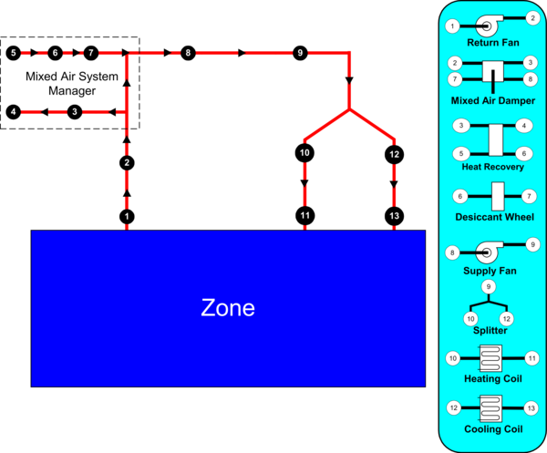

So that these loops are manageable and more clearly defined both in the
input and in the simulation, four different loop sections can be defined
in an EnergyPlus input file. In general, these four types are in essence
two pairs of loop sections that make up two distinct types of loops: a
zone/air loop and a plant loop.

-  Air Loop Supply Side: The air loop is defined by the section of the
   zone/air loop that starts after the zone return streams are combined
   and continues on until just before any air stream(s) are branched off
   to individual zones. The starting point of the air loop is fairly
   straightforward. The ending point is slightly more complex but can be
   understood with some examples. For instance, in a terminal reheat
   system, the end of the air loop would typically be considered the
   node following the cooling coil. In a dual duct system, the air loop
   would have two ending points that would correspond to the nodes after
   the cooling coil and after the heating coil/humidifier. In most
   cases, the air loop has a single starting point and up to two ending
   points (for a two-deck system). An outdoor air subsystem can be
   included in the supply side for ventilation and relief air.

-  Air Loop Zone Equipment: The zone equipment section of the input file
   is defined as more or less the rest of the zone/air loop (outside air
   is handled separately as a subset of the air loop). This includes
   everything from where the ducts are split to serve various zones up
   through where the return ducts from various zones are mixed into a
   single return duct. Zone equipment can include dampers and reheat
   coils as well as zone-specific conditioning systems such as
   thermostatic baseboard or a window air conditioner. Most control
   issues are typically dealt with in the zone equipment section of the
   simulation.

-  Plant Loop Demand Side: One side of the plant is where energy is
   “demanded” by various components that make up the air loop or zone
   equipment. Typically, this is the water side of equipment such as
   coils, baseboard, radiant heating and cooling, etc. In the case of a
   condenser loop, energy is typically “demanded” by a chiller condenser
   or other water source heat pump. The demand side of this loop can
   also include a splitter, a mixer, and a bypass.

-  Plant Loop Supply Side: The other side of the plant loop is where
   energy is “supplied” by various components. The components typically
   found on the supply side include pumps, boilers, chillers, purchased
   heating and cooling, ice storage, etc. In the case of a condenser,
   the components would be a cooling tower, fluid cooler, or ground
   source heat exchanger, etc. As with the demand side, this loop can
   also include a splitter, a mixer, and a bypass.

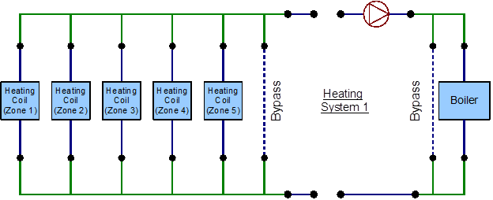

The following is a list of groups of input objects related to specifying
detailed HVAC systems in EnergyPlus related to zone equipment and
secondary systems:

-  HVAC Design Objects - describes input objects related to how
   EnergyPlus performs autosizing for air terminals, zone equipment,
   systems, and plant components as well as for outdoor air systems.

-  Node-Branch Management - used to describe some of the topological
   features of EnergyPlus such as nodes, pipes, and ducts as well as
   branches (pieces of loops) and connectors.

-  Air Distribution - describes the arrangement of the components in an
   air distribution system includes the outdoor air system, splitters,
   mixers, and plenums.

-  Zone HVAC Controls and Thermostats - input objects related to
   thermostats and humidistats used to control the conditions in a zone.

-  Zone HVAC Forced Air Units - defines input related to zone forced air
   equipment like window air conditioners, packaged terminal air
   conditions (PTAC), unit heaters, fan coil systems, and outdoor air
   units as well as other related input objects.

-  Zone HVAC Radiative/Convective Units - models baseboard systems, low-
   and high-temperature radiant systems, and active portion of
   ventilated slabs.

-  Zone HVAC Air Loop Terminal Units - describes air terminals including
   constant volume, variable volume, series and parallel powered
   induction units, and duel duct terminals.

-  Zone HVAC Equipment Connections - used to describe the HVAC equipment
   connections at the zone level.

-  Fans - describes constant volume, variable volume, exhaust fans as
   well as more system and component model fans.

-  Coils - contains a long list of input objects to model heating and
   cooling water coils; heating and cooling DX coils including two-,
   multiple-, and variable-speed units; variable refrigerant coils; fuel
   and gas coils; desuperheater coils; air to water heat pump coils; and
   other coil input objects.

-  Evaporative Coolers - describes direct and indirect evaporative
   coolers.

-  Humidifiers and Dehumidifiers - for electric and gas steam
   humidifiers as well as desiccant dehumidifiers.

-  Heat Recovery - models for air-to-air flat plate and combined
   sensible and latent heat exchangers as well as heat exchangers
   coupled with desiccants.

-  Unitary Equipment - describes unitary input objects that are
   generally placed in the primary air loop and includes heating only,
   heating and cooling, and air-to-air heat pump input objects.

-  Variable Refrigerant Flow Equipment - input objects to describe
   variable refrigerant flow (VRF) equipment as well as the controls.

The following is a list of control systems in EnergyPlus related to HVAC

-  Controllers - input objects for simple controllers that look at a
   single node and compare it with the setpoint and includes controllers
   for water coils, outdoor air, and mechanical ventilation.

-  System Availability Managers - these input objects can take an input
   from any node and control whether an entire portion of the HVAC
   system is active and can be based on temperature, differential
   temperature, schedules, night cycle, and ventilation.

-  Setpoint Managers - these take input from any node or nodes and
   calculate a setpoint at another node and include controls for single
   zone heating, cooling, or reheat; humidity control; mixed air;
   warmest or coldest; and many other scenarios.

-  Plant-Condenser Control - provides control for the plant loop
   primarily controlling the operation of the loop and which equipment
   is available and includes control based on heating or cooling load
   and in reference to outdoor conditions such as dry-bulb or wet-bulb
   temperature.

-  Plant-Condenser Flow Control - describes the TemperingValve input
   object for the special case of flow control with thermal storage
   systems.

The following is a list of input objects related to primary systems and
equipment:

-  Pumps - describes constant speed and variable speed pumps and
   headered multiple pump systems.

-  Plant-Condenser Loops - describes the supply and demand side of the
   loops the operating temperatures and flow rates.

-  Plant Heating and Cooling Equipment - used to input the central plant
   equipment such as steam and hot water boilers; electric, absorption,
   engine driven, and turbine chillers; and water-to-water heat pumps;
   as well as connections to district heating and cooling sources.

-  Condenser Equipment and Heat Exchangers - describes single-, two, and
   variable speed cooling towers; single and two speed evaporative and
   non-evaporative fluid coolers; vertical, surface, trench and slinky
   ground heat exchangers; and fluid-to-fluid heat exchangers.

-  Non-Zone Equipment - describes the LoadProfile:Plant input object
   that allows the load on the plant to be specified by schedule if
   already known.

-  User Defined HVAC and Plant Component Models - a group that allows
   the user to define custom models for zonal systems, air terminals,
   coils, and plant equipment.

The input object groups described in this section are further explained
in the InputOutputReference.

Output Reporting
----------------

The primary goal of modeling is seeing the results of the model
contained in the output reporting. EnergyPlus has several different
types of outputs, but initially the most important to understand are the
tabular output reports that summarize the results of the simulation. The
Output:Table:SummaryReports and OutputControl:Table:Style input objects
described below are the only two necessary to start generating the
tabular output reports:

-  Output:Table:SummaryReports - allows the specification of different
   tabular reports but usually just specifying AllSummary is necessary.
   Additional reports can be shown by specifying AllSummaryAndMonthly,
   AllSummaryMonthlyAndSizingPeriod.

-  OutputControl:Table:Style - specifying the output format for the
   tabular reports which is most commonly HTML but a comma, tab, fixed
   width, and XML options are also available. Depending on what is
   specified the output reports can have different file extensions and
   the file name usually has the word “Table” or “tbl” in it.

You can also create your own custom tabular reports by using one of the
following input objects:

-  Output:Table:TimeBins - shows the amount of time in hours that occurs
   in different bins for the single specific output variable or meter
   specified

-  Output:Table:Monthly - shows a series of output variables or output
   meters on a monthly basis using different aggregation schemes. For
   output variables that reoccur for each zone or other input objects,
   the monthly report will be repeated for each one.

-  Output:Table:Annual - shows a series of output variables or output
   meters on an annual basis using different aggregation schemes. For
   output variables that reoccur for each zone or other input objects,
   additional rows of results will be displayed.

-  Output:VariableDictionary - provides a list of available output
   variables for use with these custom tabular reports as well as the
   time step reporting described next. The list of output variables that
   are available for specific simulation appear in a file with a .rdd
   extension, and the output meters appear in a file with a .mdd
   extension.

When you need to dive deeper into the results for a specific output
variable or output meters, time step outputs allow you to see the values
of an output variable for each timestep or other time periods. By
looking at multiple output variables and seeing how they change together
over time, a deeper understanding of the system and control operation
can be gained.

-  Output:Variable - these input objects are added one for each output
   variable desired. Usually, an asterisk is used for the “key value”
   field so that all instances of the output variable are included. The
   output shows up in the .eso file which is generally converted to a
   .csv file for use with a spreadsheet.

-  Output:Meter and Output:Meter:MeterFileOnly - these input objects
   specify the output meters (think of them as very detailed submeters).
   The output from these input objects show up in the .mtr file which is
   generally converted to a Meter.csv file for use with a spreadsheet.
   Also, note that the .mtd file shows the exact relationship between
   specific end-use output report variables and each output meter.

-  Output:SQLite - use this input object if you want to output in the
   SQLite database format. Not only can the output variables and meters
   be in SQLite format but the tabular reports are also included.

EnergyPlus also includes a number of special reports that usually appear
in different output files or in the .eio output file

-  Output:Surfaces:List - provides a report on all the surfaces in a
   file and the output appears in the .eio and .sln output files.

-  Output:Surfaces:Drawing - provides a DXF drawing that can be opened
   in some CAD programs .

-  OutputControl:SurfaceColorScheme - controls the colors used in the
   DXF file.

-  Output:Schedules - provides a summary of the schedules in the input
   file and appears as part of the file with the .eio extension.

-  Output:Constructions - provides a summary of constructions in the
   input file and appears as part of the file with the .eio extension.

-  Output:EnergyManagementSystem - creates a list of detailed output
   related to the energy management system in a file with the .edd
   extension.

-  OutputControl:ReportingTolerances - provides more control over the
   amount of time reported for the setpoints not being met.

-  Output:Diagnostics - provides additional detail in the output
   messages in the .err file . Normally this extra detail is not shown
   to reduce confusion for new users.

-  Output:DebuggingData - provides an additional detailed output related
   to HVAC nodes in a file with a .dbg extension.

Environmental reporting adds new meters showing the emissions related to
the building and is triggered by the use of the following three input
objects. See the 5ZoneTDV.idf file for examples.

-  Output:EnvironmentalImpactFactors - specifies the frequency of the
   output variables related to emissions.

-  EnvironmentalImpactFactors - specifies the efficiency of district
   heating and cooling systems as well as the carbon equivalent emission
   factors for N20, CH4, and CO2.

-  FuelFactors - for each type of energy resource (electricity, natural
   gas, etc..) provides a way to enter factors related to source energy
   and emissions of CO2, CO, CH4, NOx, N20, SO2, PM, NH3, NMVOC, Hg, Pb,
   and other factors.

Other input objects in this group allow the accumulation of metered
results, the combination of output variables or meters to create custom
meters, and a method for preprocessors to include error messages in the
normal error file. Many example files contain some of these input
objects. All of these are described in the “Input/Output Reference” but
note that this group is described in Chapter 5 “Input for Output” and
Chapter 7 “Standard Output Reports” while most of the other groups of
input objects are described in Chapter 1. The OutputDetailsAndExamples
documentation provides even more details on the outputs created by each
of these input objects. Several other output related input objects
appear in other areas such as Output:DaylightFactors input object in the
Daylighting group.

Economics
---------

EnergyPlus contains several input objects that allow economic analysis
to be performed. When these input objects are included in the input
file, new tabular output reports are automatically generated. The input
objects used by EnergyPlus for cost estimating calculations are as
follows:

-  ComponentCost:LineItem - provides inputs related to determining the
   construction cost and can be associated with several different input
   objects and the cost estimate is based on factors such as cost per
   area or cost per unit of output capacity. It has not been applied to
   all types of input objects so for many scenarios; construction
   costing would need to be performed outside of EnergyPlus.

-  ComponentCost:Adjustments - allows the specification of adjustments
   including miscellaneous costs per conditioned area, design and
   engineering fees, contractor fees, contingency, permitting, bonding,
   and insurance as well as commissioning and regional adjustment fees.

-  ComponentCost:Reference - entry of reference building costs so that
   the current model can be compared to the reference building.

For many building projects, while energy estimates are important, the
computation of estimated utility bills provides an understanding of how
much money is going to be saved to help offset possibly higher initial
costs of a high-performance building. Due to the many different utility
companies and regulatory agencies, the approach used to compute monthly
utility bills has become widely varied and, at times, quite complicated
depending not only on energy and demand but the timing of each and the
relationship between the two. Overall, the goals of the UtilityCost
input objects of EnergyPlus are to make simple tariffs easy to model and
complex tariffs possible to model. The
5ZoneEconomicsTariffAndLifeCycleCosts.idf example file provides several
different example tariffs. The input objects used by EnergyPlus for the
calculation of monthly and annual utility bills are as follows:

-  UtilityCost:Tariff - sets the parameters for the overall tariff such
   as associated output meter, conversion factors, demand computation,
   monthly charges, and minimum charges, and schedule names for the time
   of use periods, seasons, billing cycle, and real-time pricing.

-  UtilityCost:Qualify - provides a method to qualify if a tariff
   applies to the building being modeled since utilities provide limits
   usually based on peak demand or energy consumption for each tariff.

-  UtilityCost:Charge:Simple - defines cost per unit value for a charge
   based on energy or demand or other charges for a specific season. The
   charges are arranged in a hierarchy shown in Figure X Hierarchy of
   Economic Charges.

-  UtilityCost:Charge:Block - defines a more complicated but common type
   of charge for energy or demand where the costs are defined in the
   tariff with blocks of charges (i.e., the first 1000 kWh is one cost
   per kWh, the next 5000 kWh is a second cost, and remaining kWh is a
   third cost). Like UtilityCost:Charge:Simple, the charges use the same
   hierarchy.

-  UtilityCost:Ratchet - some utilities charge not only for the current
   month’s demand but also compensate for the highest demand in recent
   months, and this input object allows the specification of such a
   structure.

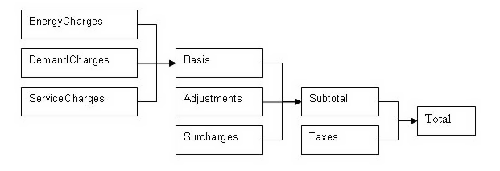

The following two input objects are uncommon to use:

-  UtilityCost:Variable - allows the specific specification of a monthly
   variable to be used in the calculation of the tariff.

-  UtilityCost:Computation - provides the step-by-step specification of
   the steps needed to compute the tariff. The output report tariff
   summary includes the default computation steps for the input objects
   specified.

Life-cycle costing allows the combination of initial and future costs
(typically energy bills) to be understood using a single metric so that
multiple building energy models can be compared even if they all have
different initial and future costs. The input objects used for
performing a life-cycle cost analysis are:

-  LifeCycleCost:Parameters - describes the discount, tax, and inflation
   rates, the approach used for inflation and discounting, as well as
   the base date and length of the study period and other parameters
   related to life-cycle costing.

-  LifeCycleCost:RecurringCosts - used to enter reoccurring costs other
   than costs related to energy and water usage since those are included
   automatically.

-  LifeCycleCost:NonrecurringCost - used to enter costs that occur only
   once during the study period.

-  LifeCycleCost:UsePriceEscalation - specifies the annual escalation of
   energy costs in future years and is generally based on government
   predictions. The increases in energy costs for future years are
   assuming they change differently than inflation. A file that is
   updated each year begins with the name LCCusePriceEscalationDataSet
   is included in the DataSets directory and is based on supplements to
   the NIST 135 handbook.

Two less commonly used input objects are

-  LifeCycleCost:UseAdjustment - allows manual adjustment of energy or
   water costs in future years.

-  CurrencyType - specifies the currency symbol of the monetary unit. If
   it is not included a dollar sign ’$’ is used in all reports.

All of these are described in the “Input/Output Reference” but note that
this group is described in Chapter 3 “EnergyPlus Economics” while most
of the other groups of input objects are described in Chapter 1. The
OutputDetailsAndExamples documentation provides even more details on the
tabular outputs created in the section labeled “eplustbl.<ext>”.

Other Groups of Input Objects
-----------------------------

The previous sections describe major groups of input objects. This
section briefly covers some of the remaining input object groups.

-  Detailed Ground Heat Transfer - provides an alternative way of
   describing ground heat transfer through basement walls and floors and
   slabs using input objects that are then processed by the SLAB and
   BASEMENT programs and is also documented in AuxiliaryPrograms.

-  Energy Management System (EMS) - a high-level control method that
   connects sensors and actuators with a simple control programming
   language and is also documented in the EMSApplicationGuide.

-  External Interface - allows the connection of EnergyPlus using
   co-simulation by the import of Functional Mockup Units (FMUs) and is
   also documented in the ExternalInterfacesApplicationGuide.

-  Operational Faults - provides for the modeling of operation problems
   in sensors, controllers, meters, equipment, and systems and is
   commonly used with existing buildings.

-  General Data Entry - contains the Matrix:TwoDimension input object
   used with the Construction:ComplexFenestrationState input object.

-  Performance Curves - allows the specification of polynomial curves
   used to characterize the performance of HVAC equipment.

-  Performance Tables - allows the specification of tables used to
   characterize the performance of HVAC equipment.

-  Fluid Properties - describes the detailed properties of refrigerants
   and glycols.

-  Demand Limiting Controls - provides a way of implementing management
   of the systems of the building to regulate the peak demand.

-  Natural Ventilation and Duct Leakage - provides a way to model
   multizone airflows driven by wind and forced air systems (shown under
   Group-Airflow Network in the InputOutputReference).

-  Room Air Models - allows the description of non-uniform room air
   temperatures (not fully mixed).

-  Compliance Objects - provides an input object that allows rotation of
   the building when used for compliance purposes.

-  Parametrics - allows for simple parametric cases to be defined within
   an input file using input objects. Makes use of the
   ParametricPreprocessor as described in the AuxiliaryPrograms
   document.

-  Refrigeration - describes supermarket and warehouse refrigeration
   systems.

-  Electric Load Center-Generator Specifications - allows the
   specification of fuel and photovoltaic generators and controls on
   when they should be used to provide power to the facility.

-  Water Systems - contains input objects to describe the use of water
   in the building including from wells, rain, and storage.

-  Solar Collectors - describes various systems that convert solar
   energy into thermal energy including those that are integrated with
   photovoltaic systems.

-  Water Heaters and Thermal Storage - describes systems that provide
   water heating and storage as well as ice and chilled water storage.
